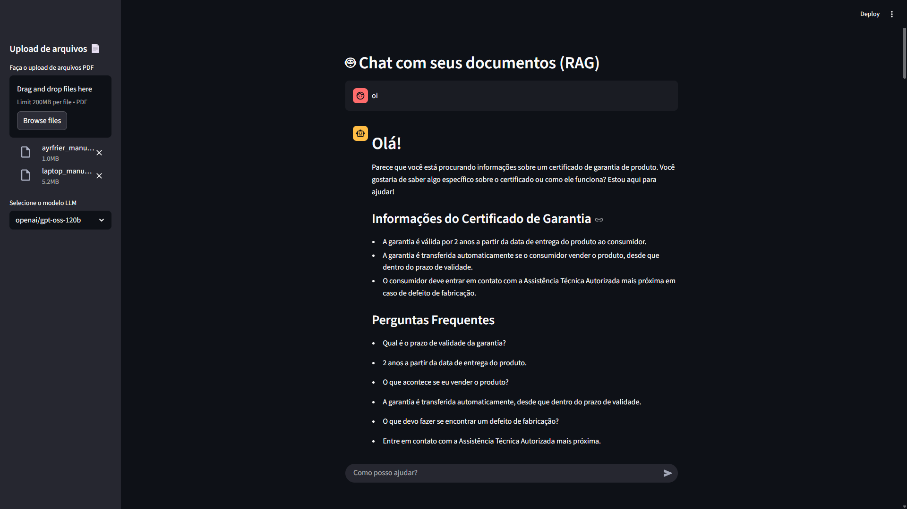
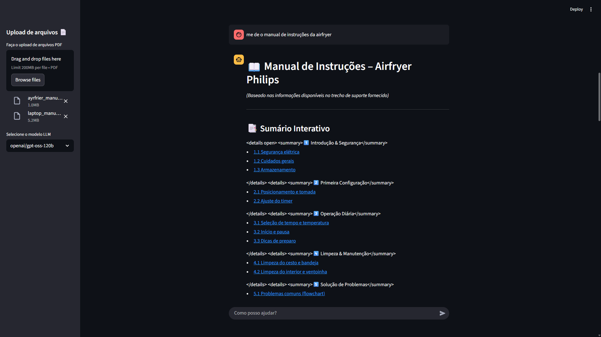
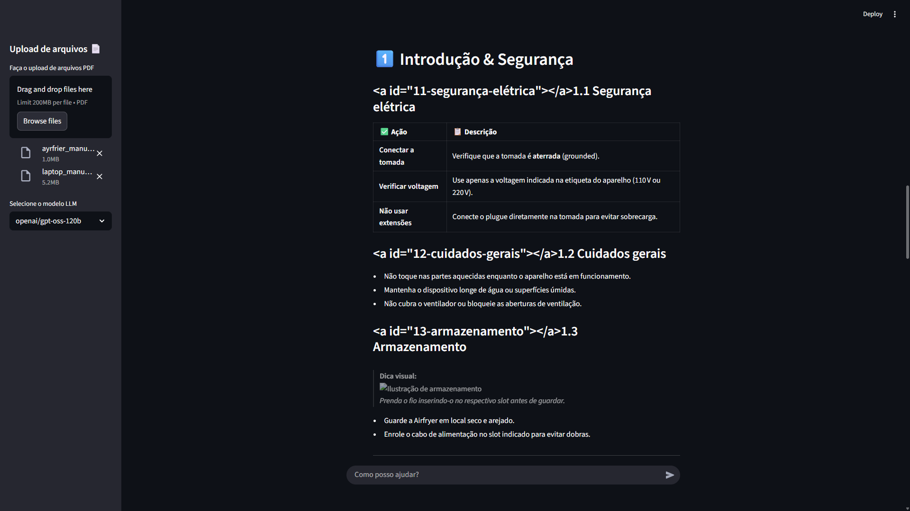
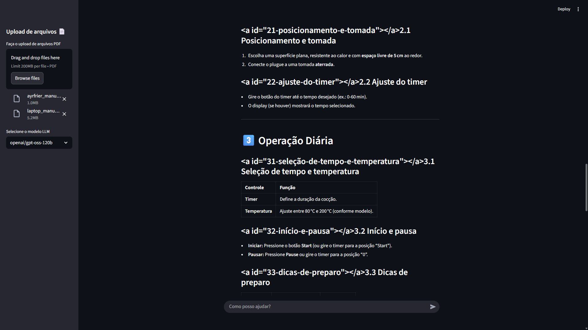

# RAG Chatbot

<div align="center">


A lightweight **Retrieval-Augmented Generation (RAG)** chatbot that lets users upload PDF files and chat with their content.

[Documentation](#documentation) • [Quick Start](#quick-start) • [Features](#features) • [Tech Stack](#tech-stack) • [Contributing](#contributing)

</div>

---

## Overview

RAG Chatbot is a Streamlit-based application for chatting with PDF documents. It uses LangChain for retrieval, ChromaDB for vector storage, Hugging Face embeddings for semantic search, and Groq for LLM responses.

The project is documented with MkDocs Material and the documentation site is the main entry point for setup, development, deployment, and technical references.

---

## Documentation

The full documentation is available here:

**[Open the documentation site](https://gabrieldlobo.github.io/07-RAG_Chatbot/)**

### Documentation Map

| Section | Purpose |
|---------|---------|
| [Getting Started](docs/getting-started.md) | Overview, prerequisites, and installation |
| [Configuration](docs/configuration.md) | Environment variables and app settings |
| [Project Structure](docs/project-structure.md) | Repository and folder layout |
| [Guidelines](docs/guidelines.md) | Code style and contribution standards |
| [Development](docs/development.md) | Development workflow and tooling |
| [Testing](docs/testing.md) | Test strategy and commands |
| [API Endpoints](docs/api-endpoints.md) | API usage and reference |
| [System Modeling](docs/system-modeling.md) | Architecture and data flow |
| [Authentication & Security](docs/authentication-security.md) | Security notes and best practices |
| [Deployment](docs/deployment.md) | Deployment instructions |
| [Contributing](docs/contributing.md) | Contribution workflow |
| [Release Notes](docs/release-notes.md) | Version history and changelog |

### Local Documentation Preview

```bash
pip install -r requirements_dev.txt
mkdocs serve -a 127.0.0.1:8001
```

Open [http://127.0.0.1:8001](http://127.0.0.1:8001) in your browser.

---

## Quick Start

### Prerequisites

- Python 3.9 or newer
- A Groq API key
- Git

### Installation

```bash
git clone https://github.com/GabrielDLobo/07-RAG_Chatbot.git
cd 07-RAG_Chatbot
python -m venv venv
```

Activate the virtual environment:

- Windows: `venv\Scripts\activate`
- macOS/Linux: `source venv/bin/activate`

Install the dependencies:

```bash
pip install -r requirements.txt
```

Create a `.env` file in the project root:

```bash
GROQ_API_KEY=your-groq-api-key-here
```

Run the app:

```bash
streamlit run app.py
```

---

## Features

- Upload one or multiple PDF files
- Automatic document chunking and embedding
- Semantic retrieval with ChromaDB
- Conversational question answering with chat history
- Groq-powered LLM responses
- Local persistence in the `db/` directory

---

## Tech Stack

| Layer | Technology |
|-------|------------|
| UI | Streamlit |
| RAG Orchestration | LangChain |
| Vector Database | ChromaDB |
| Embeddings | Hugging Face |
| LLM Provider | Groq |
| PDF Parsing | PyPDF |
| Configuration | python-dotenv |

---

## Project Structure

```text
.
├── app.py
├── docs/
├── db/
├── media/
├── requirements.txt
├── requirements_dev.txt
├── mkdocs.yml
├── pyproject.toml
└── README.md
```

---

## Development

Format and lint the code with the tools configured in `pyproject.toml`:

```bash
black .
isort .
flake8
```

Run tests with:

```bash
pytest
```

---

## Deployment

The documentation site is configured with MkDocs Material and can be published with:

```bash
mkdocs gh-deploy --clean
```

For the app itself, use the deployment workflow described in the documentation.

---

## Contributing

Contributions are welcome. Please read the documentation before opening pull requests so changes stay aligned with the project structure and workflow.

1. Fork the repository
2. Create a branch
3. Implement and test your changes
4. Update documentation when needed
5. Open a pull request

---

## License

This project is licensed under the MIT License.

---

## Project Images








