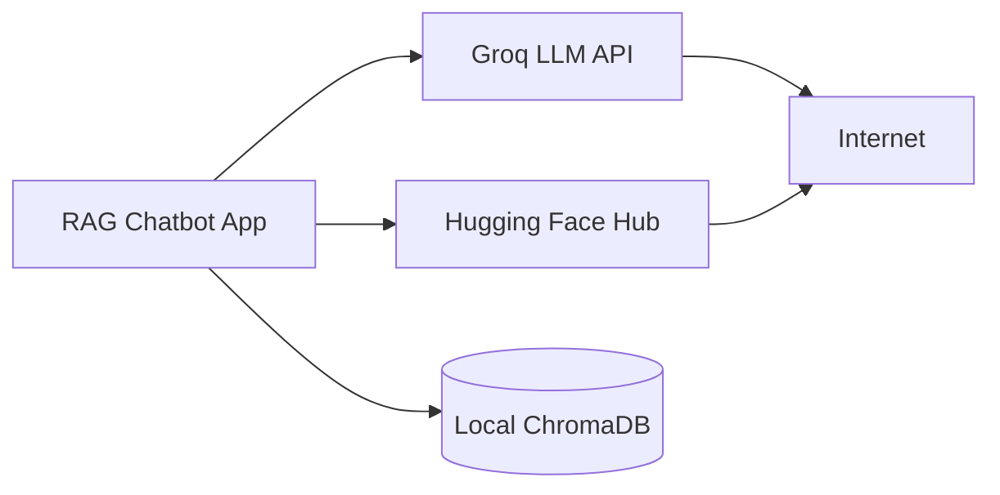
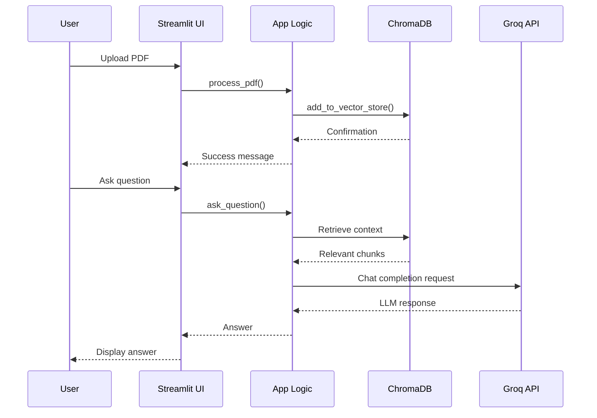

# API Endpoints

This document describes the API endpoints and external service integrations used by the RAG Chatbot application.

---

## Table of Contents

- [Overview](#overview)
- [External APIs](#external-apis)
- [Groq API](#groq-api)
- [Hugging Face API](#hugging-face-api)
- [Internal Functions](#internal-functions)
- [Streamlit UI Components](#streamlit-ui-components)

---

## Overview

The RAG Chatbot is a **client-side application** that runs locally and interacts with external APIs for LLM inference and embeddings. It does not expose traditional REST API endpoints, but rather provides internal functions and UI components.

### Architecture Type

| Aspect | Description |
|--------|-------------|
| Application Type | Streamlit Web Application |
| API Pattern | Direct API calls (no REST server) |
| External Services | Groq API, Hugging Face Models |
| Local Services | ChromaDB (embedded) |

---

## External APIs

### API Integration Overview



### External Dependencies

| Service | Purpose | Required | Documentation |
|---------|---------|----------|---------------|
| Groq | LLM Inference | ✅ Yes | [Groq Docs](https://console.groq.com/docs) |
| Hugging Face | Embeddings | ✅ Yes | [HF Docs](https://huggingface.co/docs) |
| ChromaDB | Vector Storage | ✅ Yes | [Chroma Docs](https://docs.trychroma.com/) |

---

## Groq API

### Overview

Groq provides fast LLM inference through a REST API compatible with OpenAI's format.

| Property | Value |
|----------|-------|
| Base URL | `https://api.groq.com/openai/v1` |
| Authentication | Bearer Token (API Key) |
| Rate Limits | Varies by plan |
| Models | Llama, Mixtral, Gemma, etc. |

### Authentication

```python
import os
from decouple import config

os.environ['GROQ_API_KEY'] = config('GROQ_API_KEY')
```

### API Endpoint: Chat Completions

**Endpoint:** `POST /chat/completions`

**Headers:**
```http
Authorization: Bearer ${GROQ_API_KEY}
Content-Type: application/json
```

**Request Body:**
```json
{
  "model": "llama-3.3-70b-versatile",
  "messages": [
    {
      "role": "system",
      "content": "Use the context to answer questions."
    },
    {
      "role": "user",
      "content": "What is RAG?"
    }
  ],
  "temperature": 0.7,
  "max_tokens": 1024
}
```

**Response:**
```json
{
  "id": "chatcmpl-abc123",
  "object": "chat.completion",
  "created": 1234567890,
  "model": "llama-3.3-70b-versatile",
  "choices": [
    {
      "index": 0,
      "message": {
        "role": "assistant",
        "content": "RAG stands for Retrieval-Augmented Generation..."
      },
      "finish_reason": "stop"
    }
  ],
  "usage": {
    "prompt_tokens": 50,
    "completion_tokens": 100,
    "total_tokens": 150
  }
}
```

### Available Models

| Model ID | Description | Context Window |
|----------|-------------|----------------|
| `llama-3.3-70b-versatile` | Llama 3.3 70B | 128K tokens |
| `openai/gpt-oss-120b` | GPT-OSS 120B | 128K tokens |
| `llama-3.1-8b-instant` | Llama 3.1 8B | 128K tokens |
| `mixtral-8x7b-32768` | Mixtral 8x7B | 32K tokens |

### Usage in Application

```python
from langchain_groq import ChatGroq

llm = ChatGroq(
    model="llama-3.3-70b-versatile",
    temperature=0.7,
)
```

---

## Hugging Face API

### Overview

Hugging Face provides embedding models for converting text to vectors.

| Property | Value |
|----------|-------|
| Model Repository | [huggingface.co/models](https://huggingface.co/models) |
| Default Model | `sentence-transformers/all-MiniLM-L6-v2` |
| Dimensions | 384 |
| Max Sequence | 256 tokens |

### Embedding Model Configuration

```python
from langchain_community.embeddings import HuggingFaceEmbeddings

embeddings = HuggingFaceEmbeddings(
    model_name="sentence-transformers/all-MiniLM-L6-v2",
    model_kwargs={'device': 'cpu'},
    encode_kwargs={'normalize_embeddings': True},
)
```

### Embedding Request

**Input:**
```python
text = "What is Retrieval-Augmented Generation?"
embedding = embeddings.embed_query(text)
```

**Output:**
```python
# Vector with 384 dimensions
[0.023, -0.045, 0.012, ..., 0.089]
```

### Supported Models

| Model | Dimensions | Use Case |
|-------|------------|----------|
| `all-MiniLM-L6-v2` | 384 | General purpose (fast) |
| `all-mpnet-base-v2` | 768 | Higher quality |
| `multi-qa-mpnet-base` | 768 | QA-specific |

---

## Internal Functions

### Application Functions

The application exposes these internal functions:

#### process_pdf(file)

Process an uploaded PDF file.

**Parameters:**
| Parameter | Type | Description |
|-----------|------|-------------|
| `file` | UploadedFile | Streamlit uploaded file object |

**Returns:**
| Type | Description |
|------|-------------|
| `List[Document]` | List of LangChain Document objects |

**Example:**
```python
chunks = process_pdf(uploaded_file)
```

---

#### load_existing_vector_store()

Load existing ChromaDB vector store.

**Parameters:** None

**Returns:**
| Type | Description |
|------|-------------|
| `Chroma \| None` | Vector store instance or None |

**Example:**
```python
vector_store = load_existing_vector_store()
```

---

#### add_to_vector_store(chunks, vector_store)

Add document chunks to vector store.

**Parameters:**
| Parameter | Type | Description |
|-----------|------|-------------|
| `chunks` | `List[Document]` | Document chunks to add |
| `vector_store` | `Chroma \| None` | Existing store or None |

**Returns:**
| Type | Description |
|------|-------------|
| `Chroma` | Updated vector store |

**Example:**
```python
vector_store = add_to_vector_store(chunks, vector_store)
```

---

#### ask_question(model, query, vector_store)

Generate answer to a question using RAG.

**Parameters:**
| Parameter | Type | Description |
|-----------|------|-------------|
| `model` | `str` | LLM model identifier |
| `query` | `str` | User's question |
| `vector_store` | `Chroma` | Vector store instance |

**Returns:**
| Type | Description |
|------|-------------|
| `str` | AI-generated answer |

**Example:**
```python
response = ask_question(
    model="llama-3.3-70b-versatile",
    query="How do I reset the device?",
    vector_store=vector_store,
)
```

---

## Streamlit UI Components

### File Uploader

**Component:** `st.file_uploader()`

**Configuration:**
```python
uploaded_files = st.file_uploader(
    label='Upload PDF files',
    type=['pdf'],
    accept_multiple_files=True,
)
```

**Returns:**
| Type | Description |
|------|-------------|
| `List[UploadedFile]` | List of uploaded files |

---

### Model Selector

**Component:** `st.selectbox()`

**Configuration:**
```python
selected_model = st.sidebar.selectbox(
    label='Select LLM Model',
    options=['llama-3.3-70b-versatile', 'openai/gpt-oss-120b'],
)
```

**Returns:**
| Type | Description |
|------|-------------|
| `str` | Selected model ID |

---

### Chat Input

**Component:** `st.chat_input()`

**Configuration:**
```python
question = st.chat_input('How can I help?')
```

**Returns:**
| Type | Description |
|------|-------------|
| `str \| None` | User's message or None |

---

### Chat Message Display

**Component:** `st.chat_message()`

**Configuration:**
```python
with st.chat_message('user'):
    st.write(question)

with st.chat_message('ai'):
    st.write(response)
```

---

## Data Flow

### Request Flow



---

## Error Handling

### API Errors

| Error | Cause | Handling |
|-------|-------|----------|
| `AuthenticationError` | Invalid API key | Display error message |
| `RateLimitError` | Too many requests | Show retry message |
| `TimeoutError` | Network timeout | Retry with backoff |
| `ModelError` | Invalid model | Fallback to default |

### Error Response Example

```python
try:
    response = chain.invoke({'input': query})
except AuthenticationError:
    st.error("Invalid API key. Please check your configuration.")
except RateLimitError:
    st.warning("Rate limit exceeded. Please try again later.")
except Exception as e:
    st.error(f"An error occurred: {str(e)}")
```

---

## Rate Limits

### Groq API Limits

| Plan | Requests/Minute | Tokens/Day |
|------|-----------------|------------|
| Free | 30 | 14,400 |
| Standard | 60 | 1,000,000 |
| Production | 300+ | Unlimited |

### Hugging Face Limits

| Type | Limit |
|------|-------|
| Downloads | Unlimited (cached) |
| Inference API | 30,000 tokens/month (free) |

---

## Best Practices

### API Usage

1. **Cache embeddings** - Avoid re-computing
2. **Batch requests** - When possible
3. **Handle rate limits** - Implement retry logic
4. **Monitor usage** - Track API consumption

### Security

1. **Never expose API keys** - Use environment variables
2. **Validate inputs** - Sanitize user input
3. **Use HTTPS** - All API calls
4. **Implement timeouts** - Prevent hanging requests

---

## Next Steps

- [System Modeling](system-modeling.md) - Architecture diagrams
- [Authentication & Security](authentication-security.md) - Security practices
- [Development Guide](development.md) - Development workflow
