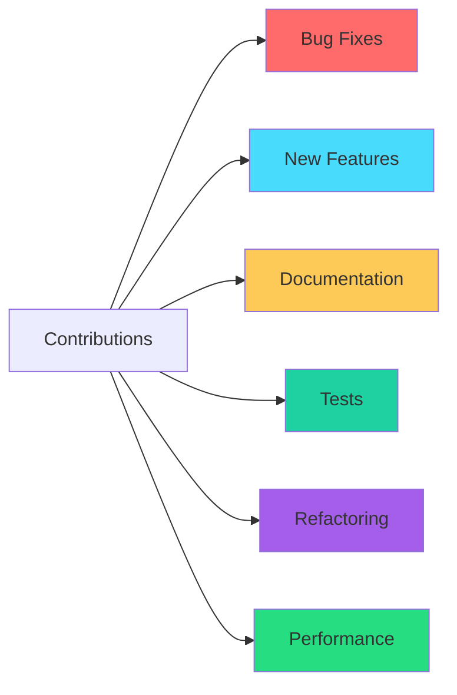
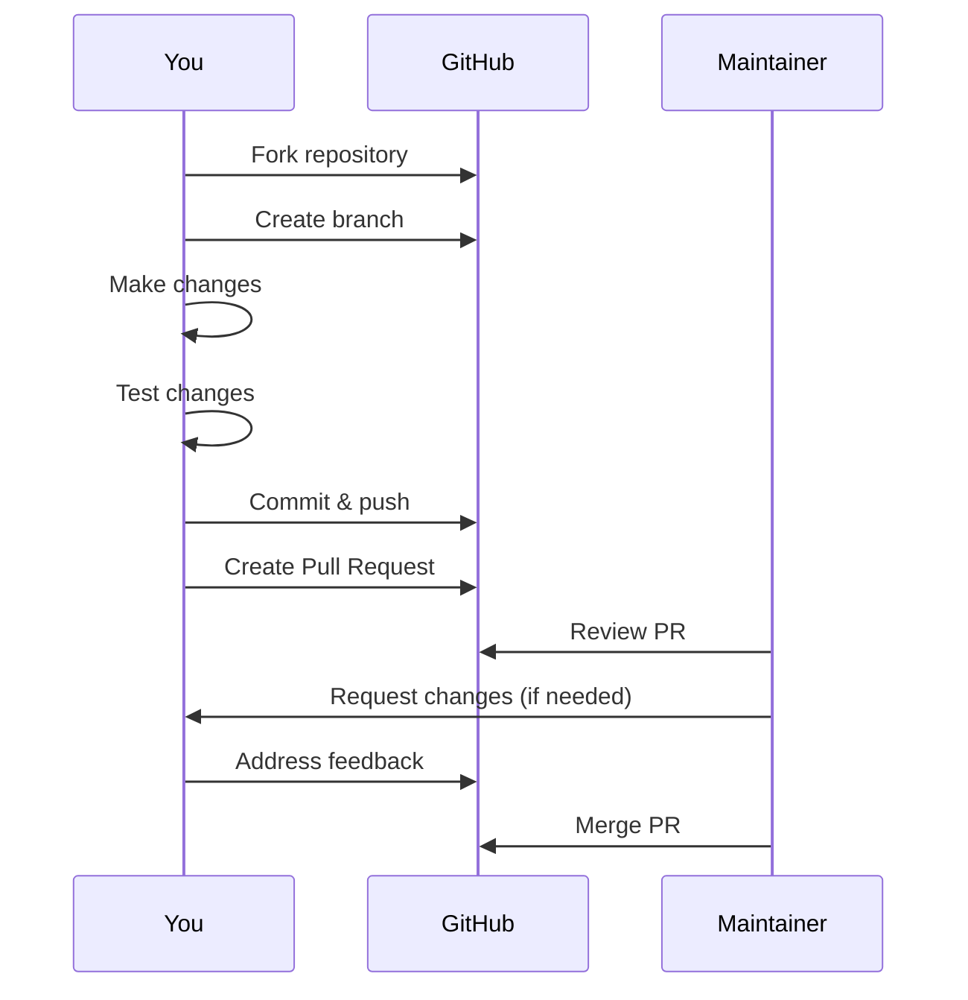
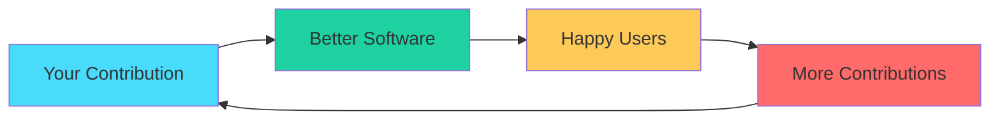

# Contributing Guide

Thank you for your interest in contributing to the RAG Chatbot project! This guide provides everything you need to know to contribute effectively.

---

## Table of Contents

- [Code of Conduct](#code-of-conduct)
- [Getting Started](#getting-started)
- [How to Contribute](#how-to-contribute)
- [Pull Request Guidelines](#pull-request-guidelines)
- [Coding Standards](#coding-standards)
- [Issue Reporting](#issue-reporting)
- [Community](#community)

---

## Code of Conduct

### Our Pledge

We pledge to make participation in our project a harassment-free experience for everyone. We welcome contributors of all backgrounds and experience levels.

### Expected Behavior

- Be respectful and inclusive
- Accept constructive criticism
- Focus on what's best for the community
- Show empathy towards others

### Unacceptable Behavior

- Harassment or discrimination
- Offensive comments
- Trolling or insulting
- Publishing others' private information

### Enforcement

Report unacceptable behavior to the project maintainers. All complaints will be reviewed and investigated promptly.

---

## Getting Started

### Prerequisites

| Requirement | Description |
|-------------|-------------|
| Git | Version control |
| Python 3.8+ | Runtime environment |
| GitHub account | For pull requests |
| Text editor | VS Code recommended |

### Setup Development Environment

```bash
# 1. Fork the repository
# Click "Fork" on GitHub

# 2. Clone your fork
git clone https://github.com/YOUR_USERNAME/07-RAG_Chatbot.git
cd 07-RAG_Chatbot

# 3. Add upstream remote
git remote add upstream https://github.com/GabrielDLobo/07-RAG_Chatbot.git

# 4. Create virtual environment
python -m venv venv
venv\Scripts\activate  # Windows
source venv/bin/activate  # Linux/Mac

# 5. Install dependencies
pip install -r requirements.txt
pip install -r requirements-dev.txt  # If exists

# 6. Create .env file
echo GROQ_API_KEY=your-test-key > .env
```

### Verify Setup

```bash
# Run the application
streamlit run app.py

# Run tests (if available)
pytest

# Check code formatting
black --check app.py
```

---

## How to Contribute

### Contribution Types



### Finding Issues to Work On

1. **Browse Issues**: Visit the [Issues page](https://github.com/GabrielDLobo/07-RAG_Chatbot/issues)
2. **Look for Labels**:
   - `good first issue` - Beginner friendly
   - `help wanted` - Need assistance
   - `bug` - Bug fixes needed
   - `enhancement` - New features
3. **Comment**: Express interest before starting work
4. **Wait for Assignment**: Maintainer will assign the issue

### Contribution Workflow



---

## Pull Request Guidelines

### PR Checklist

Before submitting a PR, ensure:

- [ ] Code follows style guidelines
- [ ] Tests pass (if applicable)
- [ ] Documentation updated
- [ ] Commit messages are clear
- [ ] No sensitive data committed
- [ ] Changes tested locally

### Branch Naming

| Type | Format | Example |
|------|--------|---------|
| Feature | `feature/description` | `feature/pdf-upload-improvement` |
| Bugfix | `fix/description` | `fix/embedding-error` |
| Hotfix | `hotfix/description` | `hotfix/api-key-validation` |
| Docs | `docs/description` | `docs/add-api-guide` |
| Refactor | `refactor/description` | `refactor/extract-functions` |

### Commit Message Format

Follow [Conventional Commits](https://www.conventionalcommits.org/):

```
type(scope): subject

body (optional)

footer (optional)
```

**Types:**

| Type | Description |
|------|-------------|
| `feat` | New feature |
| `fix` | Bug fix |
| `docs` | Documentation |
| `style` | Formatting |
| `refactor` | Code restructuring |
| `test` | Tests |
| `chore` | Maintenance |

**Examples:**

```bash
feat: add support for multiple PDF uploads
fix: resolve chunk overlap calculation error
docs: update configuration guide with new options
refactor: extract PDF processing to separate function
test: add unit tests for vector store operations
chore: update dependencies to latest versions
```

### PR Description Template

```markdown
## Description
Brief description of changes

## Type of Change
- [ ] Bug fix
- [ ] New feature
- [ ] Documentation update
- [ ] Refactoring
- [ ] Performance improvement

## Testing
Describe testing performed:
- [ ] Unit tests added/updated
- [ ] Manual testing completed
- [ ] Integration tests pass

## Checklist
- [ ] Code follows project guidelines
- [ ] Self-review completed
- [ ] Comments added where needed
- [ ] Documentation updated
- [ ] No new warnings

## Related Issues
Closes #123
```

---

## Coding Standards

### Python Style

Follow [PEP 8](https://pep8.org/):

```python
# ✅ Good
def process_pdf(file: UploadedFile) -> List[Document]:
    """Process a PDF file and return document chunks.
    
    Args:
        file: Uploaded PDF file
        
    Returns:
        List of Document objects
    """
    pass

# ❌ Bad
def ProcessPDF(file):  # Wrong naming, no type hints
    pass  # No docstring
```

### Code Review Criteria

| Criterion | Description |
|-----------|-------------|
| Correctness | Code works as intended |
| Readability | Easy to understand |
| Maintainability | Easy to modify |
| Performance | Efficient execution |
| Security | No vulnerabilities |
| Testing | Adequate test coverage |

### Documentation Standards

```python
# Module docstring
"""PDF processing module for RAG Chatbot."""

# Class docstring
class PDFProcessor:
    """Handles PDF loading, splitting, and processing."""

# Function docstring (Google style)
def split_text(text: str) -> List[str]:
    """Split text into chunks.
    
    Args:
        text: Input text to split
        
    Returns:
        List of text chunks
        
    Raises:
        ValueError: If text is empty
    """
    pass
```

---

## Issue Reporting

### Bug Report Template

```markdown
## Bug Description
Clear description of the bug

## To Reproduce
Steps to reproduce:
1. Go to '...'
2. Click on '...'
3. See error

## Expected Behavior
What should happen

## Screenshots
If applicable

## Environment
- OS: [e.g., Windows 10]
- Python: [e.g., 3.10]
- Browser: [e.g., Chrome 120]

## Additional Context
Any other relevant information
```

### Feature Request Template

```markdown
## Problem Statement
What problem does this solve?

## Proposed Solution
Describe the feature

## Alternatives Considered
Other solutions you've thought about

## Use Cases
Who will benefit from this?

## Implementation Ideas
Suggestions for implementation

## Additional Context
Any other information
```

### Issue Labels

| Label | Description |
|-------|-------------|
| `bug` | Something isn't working |
| `enhancement` | New feature request |
| `documentation` | Documentation improvements |
| `good first issue` | Good for newcomers |
| `help wanted` | Extra attention needed |
| `question` | Further information needed |
| `wontfix` | Will not be fixed |

---

## Community

### Communication Channels

| Channel | Purpose |
|---------|---------|
| GitHub Issues | Bug reports, feature requests |
| GitHub Discussions | General discussions |
| Email | Private matters |

### Response Times

| Type | Expected Response |
|------|-------------------|
| Bug reports | 1-3 days |
| Feature requests | 1 week |
| Questions | 1-3 days |
| PR reviews | 1 week |

### Becoming a Maintainer

Active contributors may be invited to become maintainers:

1. Consistent contributions (3+ months)
2. Quality code and reviews
3. Community engagement
4. Invitation from existing maintainers

---

## Recognition

### Contributors Wall

Contributors are recognized in:

- README.md contributors section
- Release notes
- Annual contributor spotlight

### Contributor Badge

Active contributors receive a badge on their profile.

---

## Legal

### License

By contributing, you agree that your contributions will be licensed under the project's license.

### Copyright

Contributors retain copyright of their contributions.

---

## Questions?

If you have questions about contributing:

1. Check existing documentation
2. Search closed issues
3. Ask in GitHub Discussions
4. Contact maintainers directly

---

## Thank You!

Every contribution makes this project better. We appreciate your time and effort!



---

## Next Steps

- [Development Guide](development.md) - Development workflow
- [Guidelines](guidelines.md) - Coding standards
- [Release Notes](release-notes.md) - Version history
