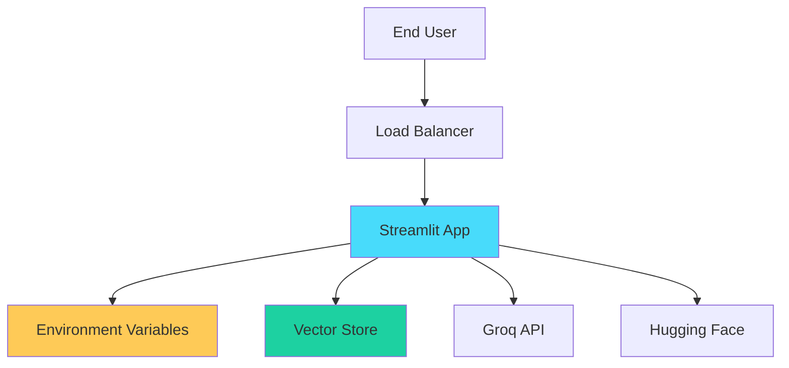
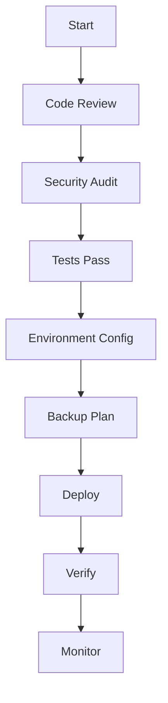
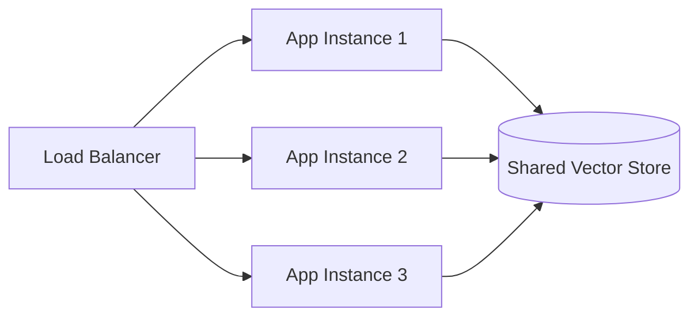

# Deployment Guide

This guide provides comprehensive instructions for deploying the RAG Chatbot application to various environments.

---

## Table of Contents

- [Deployment Overview](#deployment-overview)
- [Local Deployment](#local-deployment)
- [Cloud Deployment Options](#cloud-deployment-options)
- [Docker Deployment](#docker-deployment)
- [Streamlit Cloud](#streamlit-cloud)
- [Heroku Deployment](#heroku-deployment)
- [AWS Deployment](#aws-deployment)
- [Production Checklist](#production-checklist)

---

## Deployment Overview

### Deployment Architecture



### Deployment Requirements

| Requirement | Description | Priority |
|-------------|-------------|----------|
| Python 3.8+ | Runtime environment | Critical |
| Groq API Key | LLM inference | Critical |
| 4GB+ RAM | Minimum memory | Critical |
| Storage | Vector store persistence | High |
| HTTPS | Secure communication | High |

---

## Local Deployment

### Standard Local Deployment

```bash
# 1. Clone repository
git clone https://github.com/GabrielDLobo/07-RAG_Chatbot.git
cd 07-RAG_Chatbot

# 2. Create virtual environment
python -m venv venv
venv\Scripts\activate  # Windows
source venv/bin/activate  # Linux/Mac

# 3. Install dependencies
pip install -r requirements.txt

# 4. Configure environment
echo GROQ_API_KEY=your-key > .env

# 5. Run application
streamlit run app.py --server.address 0.0.0.0
```

### Access Locally

| Environment | URL |
|-------------|-----|
| Local | http://localhost:8501 |
| Network | http://YOUR_IP:8501 |

---

## Cloud Deployment Options

### Comparison Table

| Platform | Cost | Ease | Scalability | Best For |
|----------|------|------|-------------|----------|
| Streamlit Cloud | Free | Easy | Medium | Demos, MVPs |
| Heroku | $7+/mo | Easy | Medium | Small apps |
| AWS EC2 | $10+/mo | Medium | High | Production |
| Docker | Varies | Medium | High | Custom setups |
| GCP/Azure | $10+/mo | Medium | High | Enterprise |

---

## Docker Deployment

### Dockerfile

Create `Dockerfile`:

```dockerfile
FROM python:3.10-slim

# Set working directory
WORKDIR /app

# Install system dependencies
RUN apt-get update && apt-get install -y \
    build-essential \
    && rm -rf /var/lib/apt/lists/*

# Copy requirements
COPY requirements.txt .

# Install Python dependencies
RUN pip install --no-cache-dir -r requirements.txt

# Copy application
COPY . .

# Create db directory
RUN mkdir -p db

# Expose port
EXPOSE 8501

# Set environment variable
ENV PYTHONUNBUFFERED=1

# Health check
HEALTHCHECK --interval=30s --timeout=10s --start-period=5s --retries=3 \
    CMD curl -f http://localhost:8501/_stcore/health || exit 1

# Run application
CMD ["streamlit", "run", "app.py", "--server.address", "0.0.0.0", "--server.port", "8501"]
```

### Docker Compose

Create `docker-compose.yml`:

```yaml
version: '3.8'

services:
  rag-chatbot:
    build: .
    ports:
      - "8501:8501"
    environment:
      - GROQ_API_KEY=${GROQ_API_KEY}
    volumes:
      - ./db:/app/db
    restart: unless-stopped
    healthcheck:
      test: ["CMD", "curl", "-f", "http://localhost:8501/_stcore/health"]
      interval: 30s
      timeout: 10s
      retries: 3
```

### Build and Run Docker

```bash
# Build image
docker build -t rag-chatbot .

# Run container
docker run -d \
  -p 8501:8501 \
  -e GROQ_API_KEY=your-key \
  -v $(pwd)/db:/app/db \
  --name rag-chatbot \
  rag-chatbot

# Or use Docker Compose
docker-compose up -d

# View logs
docker logs -f rag-chatbot

# Stop container
docker-compose down
```

### .dockerignore

Create `.dockerignore`:

```
__pycache__/
*.pyc
*.pyo
.env
venv/
.git
.gitignore
*.md
db/
.streamlit/
```

---

## Streamlit Cloud

### Deployment Steps

1. **Push to GitHub**
   ```bash
   git add .
   git commit -m "Prepare for Streamlit Cloud deployment"
   git push origin main
   ```

2. **Configure Repository**
   - Make repository public (required for free tier)
   - Ensure `requirements.txt` exists

3. **Deploy on Streamlit Cloud**
   - Visit [share.streamlit.io](https://share.streamlit.io)
   - Click "New app"
   - Select your repository
   - Set main file path: `app.py`
   - Click "Deploy!"

4. **Configure Secrets**
   - Go to app settings
   - Add secrets:
   ```toml
   [groq]
   api_key = "your-groq-api-key"
   ```

### Limitations

| Limitation | Value |
|------------|-------|
| Storage | Temporary (no persistence) |
| Memory | Limited by free tier |
| CPU | Shared resources |
| Uptime | May sleep when inactive |

### Workaround for Vector Store

```python
# Use session-based vector store for Streamlit Cloud
@st.cache_resource
def get_vector_store():
    return Chroma.from_documents(
        documents=[],
        embedding=HuggingFaceEmbeddings(),
    )
```

---

## Heroku Deployment

### Procfile

Create `Procfile`:

```
web: streamlit run app.py --server.port $PORT --server.address 0.0.0.0
```

### runtime.txt

Create `runtime.txt`:

```
python-3.10.13
```

### Heroku Setup

```bash
# Install Heroku CLI
# Download from https://devcenter.heroku.com/articles/heroku-cli

# Login
heroku login

# Create app
heroku create rag-chatbot-app

# Set environment variables
heroku config:set GROQ_API_KEY=your-key

# Deploy
git push heroku main

# Open app
heroku open
```

### Buildpacks

```bash
# Add Python buildpack
heroku buildpacks:set heroku/python

# Add apt buildpack for system dependencies
heroku buildpacks:add --index 1 heroku-community/apt
```

### apt-packages

Create `Aptfile`:

```
libsm6
libxext6
libxrender-dev
```

---

## AWS Deployment

### EC2 Deployment

#### 1. Launch EC2 Instance

```bash
# AWS CLI commands
aws ec2 run-instances \
  --image-id ami-0c55b159cbfafe1f0 \
  --instance-type t3.medium \
  --key-name your-key-pair \
  --security-group-ids sg-xxxxx \
  --user-data file://user-data.sh
```

#### 2. User Data Script

Create `user-data.sh`:

```bash
#!/bin/bash
yum update -y
yum install python3 -y
yum install git -y

cd /home/ec2-user
git clone https://github.com/GabrielDLobo/07-RAG_Chatbot.git
cd 07-RAG_Chatbot

python3 -m venv venv
source venv/bin/activate
pip install -r requirements.txt

echo "GROQ_API_KEY=your-key" > .env

# Create systemd service
cat > /etc/systemd/system/rag-chatbot.service << EOF
[Unit]
Description=RAG Chatbot Streamlit App
After=network.target

[Service]
Type=simple
User=ec2-user
WorkingDirectory=/home/ec2-user/07-RAG_Chatbot
Environment="PATH=/home/ec2-user/07-RAG_Chatbot/venv/bin"
ExecStart=/home/ec2-user/07-RAG_Chatbot/venv/bin/streamlit run app.py --server.port 8501
Restart=always

[Install]
WantedBy=multi-user.target
EOF

systemctl enable rag-chatbot
systemctl start rag-chatbot
```

#### 3. Security Group Rules

| Type | Port | Source |
|------|------|--------|
| SSH | 22 | Your IP |
| HTTP | 8501 | 0.0.0.0/0 |
| HTTPS | 443 | 0.0.0.0/0 |

### Elastic Beanstalk

#### 1. Create Configuration

Create `.ebextensions/streamlit.config`:

```yaml
option_settings:
  aws:elasticbeanstalk:container:python:
    WSGIPath: app.py
  aws:elasticbeanstalk:application:environment:
    GROQ_API_KEY: your-key
```

#### 2. Deploy

```bash
# Install EB CLI
pip install awsebcli

# Initialize
eb init -p python-3.10 rag-chatbot

# Create environment
eb create production

# Deploy
eb deploy
```

---

## Production Checklist

### Pre-Deployment



### Security Checklist

- [ ] API keys stored in environment variables
- [ ] `.env` file not committed to Git
- [ ] HTTPS enabled
- [ ] Firewall rules configured
- [ ] Access controls in place
- [ ] Secrets rotated regularly

### Performance Checklist

- [ ] Caching enabled
- [ ] Vector store optimized
- [ ] Memory limits configured
- [ ] Load balancing (if needed)
- [ ] CDN for static assets

### Monitoring Checklist

- [ ] Health checks configured
- [ ] Logging enabled
- [ ] Error tracking setup
- [ ] Performance monitoring
- [ ] Alert rules configured

### Backup Checklist

- [ ] Vector store backup procedure
- [ ] Configuration backup
- [ ] Recovery procedure documented
- [ ] Backup testing scheduled

---

## Environment-Specific Configuration

### Development

```toml
# .streamlit/config.dev.toml
[server]
port = 8501
headless = false
enableCORS = true

[runner]
fastReruns = true
```

### Production

```toml
# .streamlit/config.prod.toml
[server]
port = 8501
headless = true
enableCORS = false
enableXsrfProtection = true

[browser]
gatherUsageStats = false

[runner]
fastReruns = false
```

---

## Scaling Considerations

### Horizontal Scaling



### Vertical Scaling

| Resource | Minimum | Recommended | Production |
|----------|---------|-------------|------------|
| CPU | 2 cores | 4 cores | 8+ cores |
| RAM | 4 GB | 8 GB | 16+ GB |
| Storage | 10 GB | 50 GB | 100+ GB |

---

## Troubleshooting Deployment

### Common Issues

| Issue | Solution |
|-------|----------|
| Port binding error | Use `--server.address 0.0.0.0` |
| API key not found | Check environment variables |
| Memory error | Increase instance size |
| Slow responses | Optimize chunk size |
| Connection timeout | Check firewall rules |

### Health Check Endpoint

```bash
# Test health endpoint
curl http://YOUR_URL:8501/_stcore/health

# Expected response: {"status": "ok"}
```

### Log Access

```bash
# Docker
docker logs rag-chatbot

# Heroku
heroku logs --tail

# Systemd
journalctl -u rag-chatbot -f

# Streamlit Cloud
View in dashboard
```

---

## Cost Estimates

### Monthly Costs by Platform

| Platform | Free Tier | Paid Tier | Enterprise |
|----------|-----------|-----------|------------|
| Streamlit Cloud | $0 | N/A | N/A |
| Heroku | $0 (limited) | $7-50 | $500+ |
| AWS EC2 | $0 (12mo) | $10-100 | $500+ |
| Docker (self) | N/A | Infrastructure cost |

---

## Next Steps

- [Contributing](contributing.md) - Contribution guidelines
- [Release Notes](release-notes.md) - Version history
- [Authentication & Security](authentication-security.md) - Security practices
