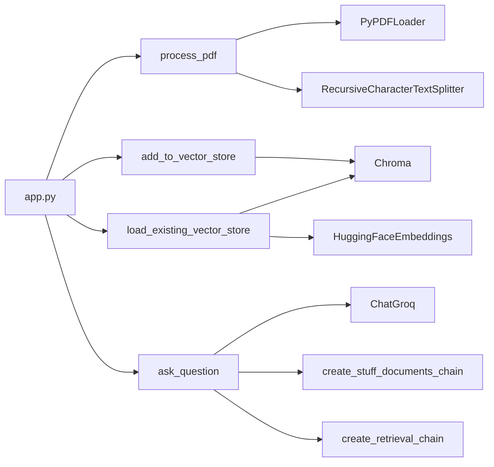

# Development Guide

This guide provides comprehensive information for developers working on the RAG Chatbot project.

---

## Table of Contents

- [Development Environment Setup](#development-environment-setup)
- [Running the Application](#running-the-application)
- [Code Structure](#code-structure)
- [Making Changes](#making-changes)
- [Debugging](#debugging)
- [Performance Optimization](#performance-optimization)
- [Common Development Tasks](#common-development-tasks)

---

## Development Environment Setup

### Prerequisites

| Software | Version | Purpose |
|----------|---------|---------|
| Python | 3.8+ | Runtime |
| pip | Latest | Package manager |
| Git | Latest | Version control |
| VS Code (optional) | Latest | IDE |

### Step-by-Step Setup

```bash
# 1. Clone the repository
git clone https://github.com/GabrielDLobo/07-RAG_Chatbot.git
cd 07-RAG_Chatbot

# 2. Create virtual environment
python -m venv venv

# 3. Activate virtual environment
# Windows
venv\Scripts\activate
# Linux/Mac
source venv/bin/activate

# 4. Install dependencies
pip install -r requirements.txt

# 5. Create .env file
echo GROQ_API_KEY=your-api-key > .env

# 6. Verify installation
streamlit run app.py
```

### VS Code Configuration

Create `.vscode/settings.json`:

```json
{
    "python.defaultInterpreterPath": "${workspaceFolder}/venv/Scripts/python.exe",
    "python.linting.enabled": true,
    "python.linting.pylintEnabled": true,
    "python.formatting.provider": "black",
    "editor.formatOnSave": true,
    "editor.rulers": [100],
    "files.exclude": {
        "**/__pycache__": true,
        "**/*.pyc": true,
        ".env": true
    }
}
```

### Recommended Extensions

| Extension | Purpose |
|-----------|---------|
| Python | Python language support |
| Pylance | Type checking |
| Black Formatter | Code formatting |
| GitLens | Git integration |
| Markdown All in One | Documentation |

---

## Running the Application

### Development Mode

```bash
# Standard run
streamlit run app.py

# With auto-reload on file changes
streamlit run app.py --server.runOnSave true

# On custom port
streamlit run app.py --server.port 8502

# In headless mode (for testing)
streamlit run app.py --server.headless true
```

### Development Server Configuration

Create `.streamlit/config.toml`:

```toml
[server]
port = 8501
runOnSave = true
enableCORS = false
enableXsrfProtection = true

[browser]
gatherUsageStats = false

[runner]
magicEnabled = true
fastReruns = true
```

---

## Code Structure

### Application Architecture

```
app.py
├── Imports (lines 1-15)
├── Configuration (lines 17-18)
├── Helper Functions
│   ├── process_pdf() (lines 20-35)
│   ├── load_existing_vector_store() (lines 37-46)
│   └── add_to_vector_store() (lines 48-55)
├── Core Functions
│   └── ask_question() (lines 57-85)
└── UI Components (lines 87-130)
```

### Function Dependencies



---

## Making Changes

### Adding a New Feature

**Example: Add support for a new LLM model**

```python
# 1. Find the model_options list (line ~97)
model_options = [
    'llama-3.3-70b-versatile',
    'openai/gpt-oss-120b',
    # 2. Add new model
    'llama-3.1-8b-instant',  # New model
]

# 3. Test the change
streamlit run app.py
```

### Modifying PDF Processing

**Example: Change chunk size**

```python
# Find RecursiveCharacterTextSplitter (line ~28)
text_spliter = RecursiveCharacterTextSplitter(
    chunk_size=1000,      # Change this value
    chunk_overlap=400,    # Adjust overlap accordingly
)
```

### Adding New Document Types

```python
# Example: Add support for TXT files
def process_text_file(file):
    """Process a text file."""
    text = file.read().decode('utf-8')
    documents = [Document(page_content=text)]
    
    text_splitter = RecursiveCharacterTextSplitter(
        chunk_size=1000,
        chunk_overlap=400,
    )
    chunks = text_splitter.split_documents(documents)
    return chunks

# Update file uploader
uploaded_files = st.file_uploader(
    label='Upload files',
    type=['pdf', 'txt'],  # Add txt support
    accept_multiple_files=True,
)

# Process based on file type
for uploaded_file in uploaded_files:
    if uploaded_file.name.endswith('.pdf'):
        chunks = process_pdf(uploaded_file)
    elif uploaded_file.name.endswith('.txt'):
        chunks = process_text_file(uploaded_file)
    all_chunks.extend(chunks)
```

---

## Debugging

### Streamlit Debug Mode

```python
# Add debug output in app.py
st.write("Debug info:", variable)
st.json({"key": "value"})
st.code(variable, language="python")
```

### Logging Setup

```python
import logging

# Configure logging
logging.basicConfig(
    level=logging.INFO,
    format='%(asctime)s - %(name)s - %(levelname)s - %(message)s'
)
logger = logging.getLogger(__name__)

# Use in code
logger.info("PDF processed successfully")
logger.error(f"Error: {str(e)}")
```

### Common Debug Scenarios

**Debug Vector Store:**

```python
# Check vector store contents
if vector_store:
    st.write(f"Documents in store: {vector_store._collection.count()}")
    
    # Test retrieval
    results = vector_store.similarity_search("test query", k=3)
    st.write(f"Retrieved {len(results)} documents")
    for i, doc in enumerate(results):
        st.write(f"Doc {i}: {doc.page_content[:200]}...")
```

**Debug Embeddings:**

```python
from langchain_community.embeddings import HuggingFaceEmbeddings

embeddings = HuggingFaceEmbeddings()
test_embedding = embeddings.embed_query("test")
st.write(f"Embedding dimensions: {len(test_embedding)}")
```

**Debug API Calls:**

```python
# Test Groq connection
from langchain_groq import ChatGroq

try:
    llm = ChatGroq(model="llama-3.3-70b-versatile")
    response = llm.invoke("Hello")
    st.success("API connection successful")
    st.write(f"Response: {response.content}")
except Exception as e:
    st.error(f"API error: {str(e)}")
```

---

## Performance Optimization

### Chunk Size Optimization

| Document Type | Chunk Size | Overlap | Reasoning |
|---------------|------------|---------|-----------|
| Technical docs | 1000 | 400 | Balance context/speed |
| Legal docs | 1500 | 500 | Preserve context |
| Simple text | 500 | 200 | Faster retrieval |

### Retrieval Optimization

```python
# Optimize retriever settings
retriever = vector_store.as_retriever(
    search_type="similarity",
    search_kwargs={
        "k": 4,  # Number of results to return
        # "score_threshold": 0.5,  # Minimum similarity score
    }
)
```

### Memory Management

```python
# Clear session state when needed
if st.sidebar.button("Clear Chat History"):
    st.session_state.messages = []
    st.rerun()

# Limit message history
MAX_MESSAGES = 50
if len(st.session_state.messages) > MAX_MESSAGES:
    st.session_state.messages = st.session_state.messages[-MAX_MESSAGES:]
```

### Caching

```python
# Cache expensive operations
@st.cache_resource
def get_embeddings():
    return HuggingFaceEmbeddings()

@st.cache_data
def process_pdf_cached(file_bytes, file_name):
    # Process PDF from bytes
    ...
```

---

## Common Development Tasks

### Reset Vector Store

```bash
# Delete vector store
rm -rf db

# Or programmatically
import shutil
if os.path.exists('db'):
    shutil.rmtree('db')
```

### Update Dependencies

```bash
# Check for outdated packages
pip list --outdated

# Update all packages
pip install --upgrade -r requirements.txt

# Update specific package
pip install --upgrade streamlit
```

### Export/Import Vector Store

```python
# Export
import pickle

with open('vector_store_backup.pkl', 'wb') as f:
    pickle.dump(vector_store, f)

# Import
with open('vector_store_backup.pkl', 'rb') as f:
    vector_store = pickle.load(f)
```

### Add Custom Prompt

```python
# Modify system_prompt in ask_question()
system_prompt = '''
You are a helpful AI assistant specialized in {domain}.
Use the provided context to answer questions accurately.
If the context doesn't contain the answer, say so clearly.

Answer format:
- Use markdown formatting
- Include code blocks when relevant
- Cite specific sections when possible

Context: {context}
'''
```

### Add Model Configuration

```python
# Add model-specific settings
model_configs = {
    'llama-3.3-70b-versatile': {
        'temperature': 0.7,
        'max_tokens': 2048,
    },
    'openai/gpt-oss-120b': {
        'temperature': 0.5,
        'max_tokens': 4096,
    },
}

# Use in ask_question()
config = model_configs.get(model, {'temperature': 0.7})
llm = ChatGroq(model=model, **config)
```

---

## Git Workflow

### Branch Strategy

```bash
# Create feature branch
git checkout -b feature/new-model-support

# Make changes and commit
git add .
git commit -m "feat: add support for llama-3.1-8b-instant model"

# Push to remote
git push origin feature/new-model-support

# Create Pull Request on GitHub
```

### Commit Message Format

```
feat: Add new feature
fix: Fix bug
docs: Update documentation
refactor: Code refactoring
test: Add tests
chore: Maintenance tasks
```

### Example Commits

```bash
git commit -m "feat: add support for TXT file uploads"
git commit -m "fix: resolve chunk overlap calculation error"
git commit -m "docs: update configuration guide"
git commit -m "refactor: extract PDF processing to separate function"
```

---

## Code Quality

### Linting

```bash
# Install linter
pip install pylint

# Run linter
pylint app.py

# Auto-fix with black
pip install black
black app.py
```

### Type Checking

```bash
# Install mypy
pip install mypy

# Run type checker
mypy app.py
```

### Pre-commit Hooks

Create `.pre-commit-config.yaml`:

```yaml
repos:
  - repo: https://github.com/psf/black
    rev: 24.1.0
    hooks:
      - id: black
  - repo: https://github.com/pycqa/flake8
    rev: 7.0.0
    hooks:
      - id: flake8
```

---

## Troubleshooting

### Common Development Issues

| Issue | Solution |
|-------|----------|
| Import errors | Check virtual environment activation |
| Port in use | Use `--server.port` flag |
| API key errors | Verify `.env` file location |
| Slow performance | Reduce chunk size or k value |
| Memory issues | Clear session state regularly |

### Getting Help

1. Check existing documentation
2. Review error messages carefully
3. Search GitHub issues
4. Check LangChain/Streamlit docs

---

## Next Steps

- [Testing Guide](testing.md) - Testing procedures
- [Contributing](contributing.md) - Contribution guidelines
- [Deployment](deployment.md) - Deployment instructions
