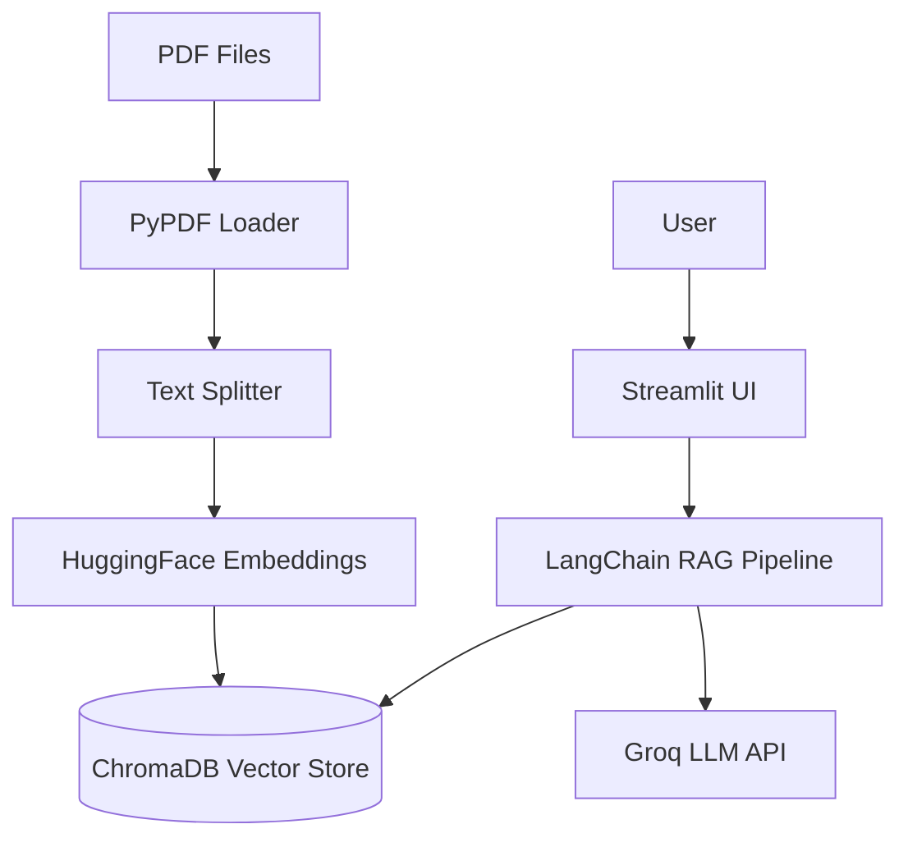

# RAG Chatbot Documentation

Welcome to the **RAG Chatbot** documentation. This guide provides comprehensive information about the project, from setup to deployment.

---

## 📖 Table of Contents

| Section | Description |
|---------|-------------|
| [Getting Started](getting-started.md) | Overview, prerequisites, installation, and quick start guide |
| [Configuration](configuration.md) | Environment variables and project configuration |
| [Guidelines](guidelines.md) | Coding standards and best practices |
| [Project Structure](project-structure.md) | Directory and file organization |
| [API Endpoints](api-endpoints.md) | Available endpoints and usage |
| [System Modeling](system-modeling.md) | Data models, architecture, and flow diagrams |
| [Authentication & Security](authentication-security.md) | Security practices and authentication |
| [Development](development.md) | Development workflow and guidelines |
| [Testing](testing.md) | Testing strategies and procedures |
| [Deployment](deployment.md) | Deployment instructions and options |
| [Contributing](contributing.md) | How to contribute to the project |
| [Release Notes](release-notes.md) | Version history and changelog |

---

## 🚀 Quick Start

```bash
# Clone the repository
git clone https://github.com/GabrielDLobo/07-RAG_Chatbot.git
cd 07-RAG_Chatbot

# Install dependencies
pip install -r requirements.txt

# Configure environment
echo "GROQ_API_KEY=your-api-key-here" > .env

# Run the application
streamlit run app.py
```

---

## 📌 What is RAG Chatbot?

**RAG (Retrieval-Augmented Generation) Chatbot** is a minimal chatbot application that allows you to:

- **Upload PDF files** and automatically index their content
- **Chat with document content** using natural language
- **Get accurate answers** backed by retrieved context from your documents

The application uses **LangChain** for RAG pipeline, **ChromaDB** for vector storage, **Hugging Face embeddings** for text embedding, and **Groq LLMs** for inference.

---

## 🏗️ Architecture Overview



---

## 📸 Screenshots

| Upload Interface | Chat Interface |
|-----------------|----------------|
|  |  |
|  |  |

---

## 🔗 Links

- [GitHub Repository](https://github.com/GabrielDLobo/07-RAG_Chatbot)
- [LangChain Documentation](https://python.langchain.com/)
- [Streamlit Documentation](https://docs.streamlit.io/)
- [Groq API](https://console.groq.com/)
- [ChromaDB Documentation](https://docs.trychroma.com/)

---

## 📄 License

This project is open source. See the repository for license information.

---

## 🤝 Support

For issues, questions, or contributions, please visit the [GitHub repository](https://github.com/GabrielDLobo/07-RAG_Chatbot).
