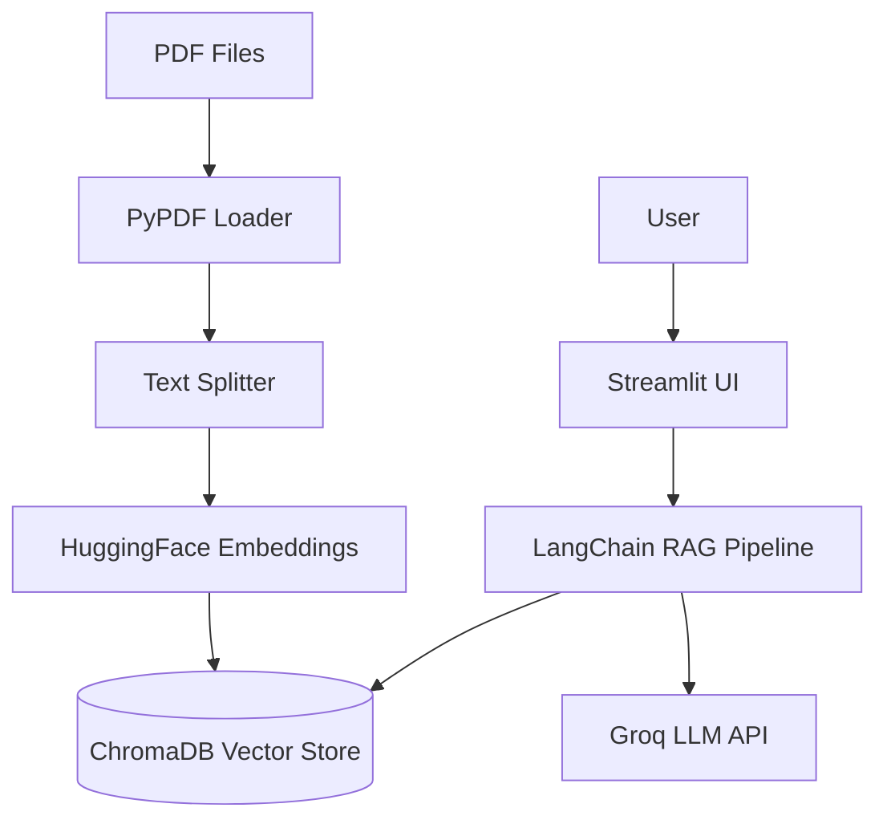

# RAG Chatbot - Documentation

Welcome to the **RAG Chatbot** documentation. This guide provides comprehensive information about the project, from setup to deployment.

## 📚 Documentation Index

### Getting Started
- [**Getting Started**](getting-started.md) - Project overview, prerequisites, installation, and quick start
- [**Configuration**](configuration.md) - Environment variables and application settings

### Development
- [**Project Structure**](project-structure.md) - Directory and file organization
- [**Guidelines**](guidelines.md) - Coding standards and best practices
- [**Development**](development.md) - Development workflow and tools
- [**Testing**](testing.md) - Testing strategies and commands

### Technical Documentation
- [**API Endpoints**](api-endpoints.md) - API reference and usage examples
- [**System Modeling**](system-modeling.md) - Data flow and architecture diagrams
- [**Authentication & Security**](authentication-security.md) - Security implementation and recommendations

### Deployment & Contribution
- [**Deploy**](deployment.md) - Deployment instructions
- [**Contribution**](contributing.md) - How to contribute
- [**Release Notes**](release-notes.md) - Version history and changelog

---

## 🚀 Quick Start

```bash
# Clone the repository
git clone https://github.com/GabrielDLobo/07-RAG_Chatbot.git
cd 07-RAG_Chatbot

# Install dependencies
pip install -r requirements.txt

# Configure environment
echo GROQ_API_KEY=your-api-key-here > .env

# Run the application
streamlit run app.py
```

---

## 📖 What is RAG Chatbot?

The **RAG Chatbot** is a Streamlit-based application that allows users to upload PDF files and chat with document content.

It combines retrieval and generation to provide grounded answers:

- ✅ **PDF Upload** - Upload one or multiple files
- ✅ **Document Chunking** - Automatic chunk creation
- ✅ **Vector Search** - Semantic retrieval with ChromaDB
- ✅ **Conversational Interface** - Natural language Q&A
- ✅ **LLM Responses** - Powered by Groq models
- ✅ **Persistent Storage** - Local vector persistence in `db/`

---

## 🏗️ System Architecture



---

## 📊 Key Features

| Feature | Description |
|---------|-------------|
| **PDF Ingestion** | Upload and parse PDF documents for indexing |
| **Semantic Retrieval** | Retrieve relevant chunks from vector store |
| **Context-Aware Answers** | Generate responses grounded in retrieved context |
| **Chat History** | Multi-turn conversation in Streamlit chat interface |
| **Groq Models** | Model selection through sidebar |
| **Local Persistence** | Saved vector database in `db/` directory |

---

## 🛠️ Tech Stack

| Layer | Technology |
|-------|------------|
| **Application** | Python 3.11, Streamlit |
| **RAG Orchestration** | LangChain |
| **Vector Database** | ChromaDB |
| **Embeddings** | Hugging Face Embeddings |
| **LLM** | Groq |
| **PDF Processing** | PyPDF |
| **Documentation** | MkDocs Material |

---

## 📞 Support

For issues, questions, or contributions, please refer to the [Contribution Guide](contributing.md).

---

**Version**: 1.0.0
**Last Updated**: April 2026
**License**: MIT
