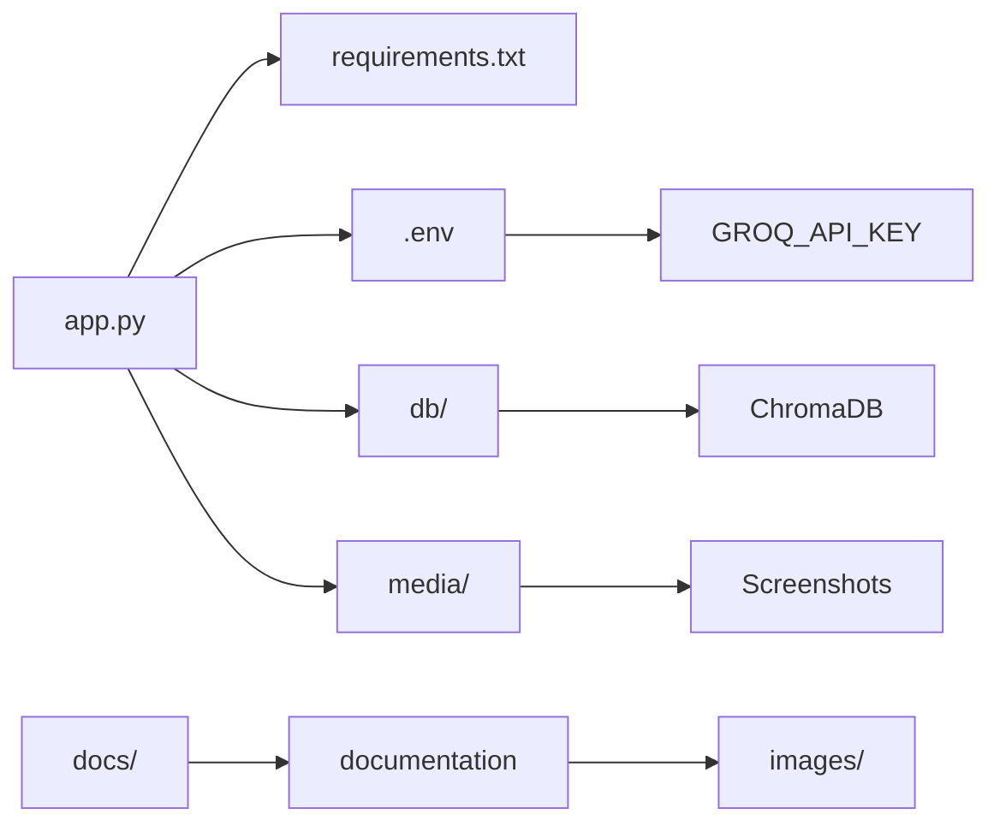

# Project Structure

This document describes the directory structure and file organization of the RAG Chatbot project.

---

## Table of Contents

- [Overview](#overview)
- [Root Directory](#root-directory)
- [Core Files](#core-files)
- [Directories](#directories)
- [Generated Files](#generated-files)

---

## Overview

```
07-RAG_Chatbot/
├── app.py                    # Main Streamlit application
├── requirements.txt          # Python dependencies
├── README.md                 # Project readme (root level)
├── .gitignore               # Git ignore rules
├── .env                     # Environment variables (not tracked)
├── docs/                    # Documentation directory
│   ├── index.md
│   ├── getting-started.md
│   ├── configuration.md
│   ├── guidelines.md
│   ├── project-structure.md
│   ├── api-endpoints.md
│   ├── system-modeling.md
│   ├── authentication-security.md
│   ├── development.md
│   ├── testing.md
│   ├── deployment.md
│   ├── contributing.md
│   ├── release-notes.md
│   └── images/              # Documentation images
│       ├── 1.png
│       ├── 2.png
│       ├── 3.png
│       └── 4.png
├── db/                      # ChromaDB persistence directory
│   ├── chroma.sqlite3
│   └── <uuid>/
│       ├── data_level0.bin
│       ├── header.bin
│       ├── length.bin
│       └── link_lists.bin
├── media/                   # Project images for README
│   ├── 1.png
│   ├── 2.png
│   ├── 3.png
│   └── 4.png
└── venv/                    # Python virtual environment
    ├── Scripts/
    ├── Lib/
    └── pyvenv.cfg
```

---

## Root Directory

### Core Files

| File | Purpose | Size | Editable |
|------|---------|------|----------|
| `app.py` | Main Streamlit application containing RAG pipeline | ~150 lines | ✅ Yes |
| `requirements.txt` | Python package dependencies | ~120 packages | ✅ Yes |
| `README.md` | Project overview and quick start guide | Markdown | ✅ Yes |
| `.gitignore` | Git ignore patterns | Text | ✅ Yes |
| `.env` | Environment variables (API keys) | Text | ✅ Yes |

---

## Core Files Detail

### app.py

The main application file containing:

| Section | Lines | Description |
|---------|-------|-------------|
| Imports | 1-15 | Required libraries and modules |
| Configuration | 17-18 | API key setup and constants |
| PDF Processing | 20-35 | `process_pdf()` function |
| Vector Store | 37-55 | Load/add vector store functions |
| Q&A Pipeline | 57-85 | `ask_question()` function |
| UI Components | 87-130 | Streamlit interface |

**Key Functions:**

```python
process_pdf(file)              # Process uploaded PDF
load_existing_vector_store()   # Load persisted vectors
add_to_vector_store(chunks)    # Add documents to store
ask_question(model, query)     # Generate AI response
```

### requirements.txt

Contains all Python dependencies:

| Category | Packages |
|----------|----------|
| Core | streamlit, langchain, langchain-community |
| Vector DB | chromadb |
| LLM | langchain-groq, groq |
| Embeddings | sentence-transformers, huggingface-hub |
| PDF | pypdf |
| Utils | python-decouple, numpy, pandas |

### README.md

Project readme with:

- Project description
- Features list
- Tech stack overview
- Setup instructions
- Usage guide
- Screenshots

---

## Directories

### docs/

Documentation directory containing all project documentation.

| File | Description |
|------|-------------|
| `index.md` | Documentation home page |
| `getting-started.md` | Installation and quick start |
| `configuration.md` | Environment and app configuration |
| `guidelines.md` | Coding standards and best practices |
| `project-structure.md` | This file |
| `api-endpoints.md` | API documentation |
| `system-modeling.md` | Architecture and flow diagrams |
| `authentication-security.md` | Security documentation |
| `development.md` | Development guide |
| `testing.md` | Testing procedures |
| `deployment.md` | Deployment instructions |
| `contributing.md` | Contribution guidelines |
| `release-notes.md` | Version history |

### docs/images/

Images used in documentation files.

| Image | Description |
|-------|-------------|
| `1.png` | Upload interface screenshot |
| `2.png` | Chat interface screenshot |
| `3.png` | Model selection screenshot |
| `4.png` | Response example screenshot |

### db/

ChromaDB persistence directory (auto-generated).

**Structure:**

```
db/
├── chroma.sqlite3           # ChromaDB metadata
└── <uuid>/                  # Collection directory
    ├── data_level0.bin      # Vector data
    ├── header.bin           # Index header
    ├── length.bin           # Document lengths
    └── link_lists.bin       # HNSW graph links
```

**Note:** This directory is created on first run. Delete to reset vector store.

### media/

Images used in the root README.md file.

| Image | Description |
|-------|-------------|
| `1.png` | Screenshot 1 |
| `2.png` | Screenshot 2 |
| `3.png` | Screenshot 3 |
| `4.png` | Screenshot 4 |

### venv/

Python virtual environment (not tracked by Git).

**Structure:**

```
venv/
├── Scripts/              # Windows executables
│   ├── python.exe
│   ├── pip.exe
│   └── activate.bat
├── Lib/                  # Python packages
│   └── site-packages/
└── pyvenv.cfg           # Configuration
```

**Note:** Never commit this directory. Create fresh with `python -m venv venv`.

---

## Generated Files

### Runtime Generated Files

| File/Directory | Created By | Purpose |
|----------------|------------|---------|
| `db/` | ChromaDB | Vector storage |
| `.streamlit/` | Streamlit | Session state and config |
| `__pycache__/` | Python | Bytecode cache |
| `*.pyc` | Python | Compiled Python |

### Temporary Files

| Pattern | Created By | Cleanup |
|---------|------------|---------|
| `tmp*.pdf` | `process_pdf()` | Auto-deleted |
| `.streamlit/secrets.toml` | Streamlit | Manual |

---

## File Relationships



---

## Adding New Files

### New Features

When adding new features, follow this structure:

```
07-RAG_Chatbot/
├── components/            # New UI components (if extracted)
│   └── sidebar.py
├── services/              # Business logic (if extracted)
│   ├── pdf_processor.py
│   └── vector_store.py
└── tests/                 # Unit tests (if added)
    └── test_app.py
```

### New Documentation

Add to `docs/` directory:

```bash
# New documentation file
touch docs/new-feature.md

# New image for docs
cp image.png docs/images/feature-screenshot.png
```

---

## Git Tracked vs Ignored

### Tracked by Git

```
✅ app.py
✅ requirements.txt
✅ README.md
✅ .gitignore
✅ docs/**
✅ media/**
```

### Ignored by Git

```
❌ .env
❌ db/
❌ venv/
❌ __pycache__/
❌ *.pyc
❌ .streamlit/
```

---

## Size Estimates

| Directory | Approximate Size | Contents |
|-----------|------------------|----------|
| `app.py` | ~5 KB | Application code |
| `requirements.txt` | ~3 KB | Dependency list |
| `docs/` | ~100 KB | Documentation + images |
| `db/` | 10 MB - 1 GB | Vector embeddings (varies) |
| `venv/` | ~500 MB | Python packages |
| `media/` | ~200 KB | Screenshots |

---

## Navigation

| Previous | Next |
|----------|------|
| [Guidelines](guidelines.md) | [API Endpoints](api-endpoints.md) |

---

## Quick Reference

### Common Paths

```bash
# Application entry point
./app.py

# Dependencies
./requirements.txt

# Documentation
./docs/index.md

# Vector store
./db/

# Environment config
./.env
```

### Important Commands

```bash
# Run application
streamlit run app.py

# Install dependencies
pip install -r requirements.txt

# Reset vector store
rm -rf db/

# View documentation
# Open docs/index.md in browser
```

---

## Next Steps

- [API Endpoints](api-endpoints.md) - Available endpoints
- [System Modeling](system-modeling.md) - Architecture diagrams
- [Development Guide](development.md) - Development workflow
