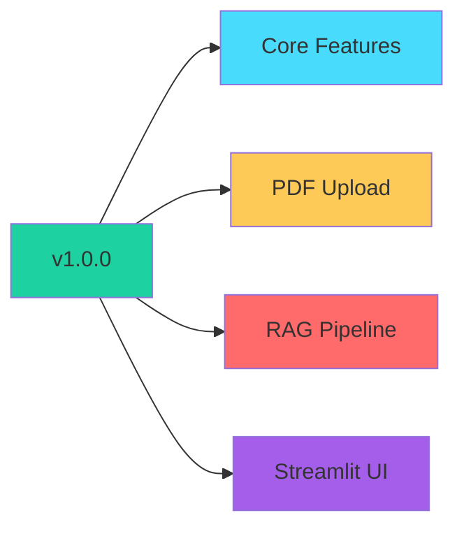
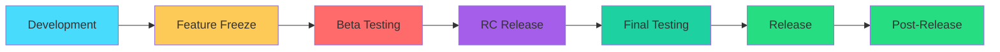

# Release Notes

This document contains the release notes and version history for the RAG Chatbot project.

---

## Table of Contents

- [Latest Release](#latest-release)
- [Version History](#version-history)
- [Release Process](#release-process)
- [Version Numbering](#version-numbering)

---

## Latest Release

### Version 1.0.0 - Initial Release

**Release Date:** April 1, 2026

**Summary:** Initial release of the RAG Chatbot application with core functionality for uploading PDF documents and chatting with their content.



#### Features

| Feature | Description | Status |
|---------|-------------|--------|
| PDF Upload | Upload single or multiple PDF files | ✅ Complete |
| Text Processing | Automatic chunking with RecursiveCharacterTextSplitter | ✅ Complete |
| Vector Store | ChromaDB persistence in local `db/` directory | ✅ Complete |
| Embeddings | HuggingFace sentence-transformers | ✅ Complete |
| LLM Integration | Groq API with multiple model support | ✅ Complete |
| Chat Interface | Streamlit-based conversational UI | ✅ Complete |
| Session Management | Conversation history in session_state | ✅ Complete |
| Model Selection | Dropdown for LLM model selection | ✅ Complete |

#### Technical Specifications

| Component | Version/Specification |
|-----------|----------------------|
| Python | 3.8+ |
| Streamlit | 1.49.1 |
| LangChain | 0.3.27 |
| ChromaDB | 1.1.0 |
| Groq | 0.31.1 |
| HuggingFace Embeddings | sentence-transformers |

#### Supported Models

- `llama-3.3-70b-versatile`
- `openai/gpt-oss-120b`

#### Known Issues

| Issue | Impact | Workaround |
|-------|--------|------------|
| No user authentication | Single-user only | Local deployment recommended |
| Vector store persistence | Manual reset required | Delete `db/` folder |
| No file type validation beyond PDF | Limited document support | Convert to PDF before upload |

#### Installation

```bash
git clone https://github.com/GabrielDLobo/07-RAG_Chatbot.git
cd 07-RAG_Chatbot
pip install -r requirements.txt
echo GROQ_API_KEY=your-key > .env
streamlit run app.py
```

---

## Version History

### Upcoming Versions

#### Version 1.1.0 (Planned)

**Target Date:** Q2 2026

**Planned Features:**

- [ ] Support for additional file types (TXT, DOCX)
- [ ] User authentication system
- [ ] Document management (list, delete)
- [ ] Search history persistence
- [ ] Export conversations
- [ ] Custom chunking settings UI

**Status:** 📋 Planning

#### Version 1.2.0 (Planned)

**Target Date:** Q3 2026

**Planned Features:**

- [ ] Multi-user support
- [ ] Role-based access control
- [ ] Advanced search filters
- [ ] Citation/references in responses
- [ ] Response feedback system
- [ ] Analytics dashboard

**Status:** 🔮 Roadmap

---

### Previous Versions

#### Version 0.x.x (Development)

**Period:** Initial Development

**Milestones:**

| Milestone | Date | Description |
|-----------|------|-------------|
| Project Inception | Jan 2026 | Initial concept |
| First Prototype | Feb 2026 | Basic RAG pipeline |
| UI Development | Mar 2026 | Streamlit interface |
| Beta Testing | Mar 2026 | Internal testing |
| Release Candidate | Apr 2026 | Final testing |
| v1.0.0 Release | Apr 2026 | Initial release |

---

## Release Process

### Release Workflow



### Release Checklist

#### Pre-Release

- [ ] All features tested
- [ ] Documentation updated
- [ ] Changelog prepared
- [ ] Version number updated
- [ ] Dependencies updated
- [ ] Security audit completed
- [ ] Performance benchmarks run

#### Release

- [ ] Git tag created
- [ ] GitHub release published
- [ ] Release notes published
- [ ] Documentation deployed
- [ ] Announcement prepared

#### Post-Release

- [ ] Monitor for bugs
- [ ] Address critical issues
- [ ] Collect user feedback
- [ ] Update roadmap
- [ ] Plan next release

### Version Numbering

Follow [Semantic Versioning](https://semver.org/):

```
MAJOR.MINOR.PATCH

Examples:
1.0.0 - Initial release
1.1.0 - Minor feature update
1.1.1 - Bug fix patch
2.0.0 - Breaking changes
```

| Component | When to Increment |
|-----------|-------------------|
| MAJOR | Breaking changes |
| MINOR | New features (backward compatible) |
| PATCH | Bug fixes (backward compatible) |

---

## Breaking Changes Policy

### Definition

Breaking changes include:

- Removing public APIs
- Changing function signatures
- Modifying default behavior
- Requiring new dependencies
- Changing data formats

### Notification

Breaking changes will be:

1. Documented in release notes
2. Marked with ⚠️ warning
3. Included in migration guide
4. Announced in advance when possible

### Migration Guide

For breaking changes, a migration guide will be provided:

```markdown
## Migration Guide: v1.x to v2.0

### Changes Required

1. Update configuration format
2. Modify API calls
3. Re-index existing documents

### Step-by-Step

1. Backup your data
2. Update to v2.0
3. Run migration script
4. Verify functionality
```

---

## Deprecation Policy

### Deprecation Timeline

| Phase | Duration | Description |
|-------|----------|-------------|
| Announced | 1 release | Deprecation warning added |
| Deprecated | 2 releases | Feature still works |
| Removed | 3+ releases | Feature removed |

### Deprecation Warnings

```python
import warnings

def old_function():
    warnings.warn(
        "old_function is deprecated and will be removed in v2.0. "
        "Use new_function() instead.",
        DeprecationWarning,
        stacklevel=2,
    )
```

---

## Bug Fix Policy

### Severity Levels

| Level | Description | Response Time |
|-------|-------------|---------------|
| Critical | Data loss, security | 24 hours |
| High | Major functionality broken | 1 week |
| Medium | Minor functionality | 2 weeks |
| Low | Cosmetic, UX | Next release |

### Bug Fix Releases

Bug fix releases (PATCH versions) are released as needed based on severity.

---

## Release Schedule

### Regular Releases

| Type | Frequency |
|------|-----------|
| Major | Quarterly |
| Minor | Monthly |
| Patch | As needed |

### Release Calendar

```
Q1 2026: v1.0.0 (Initial Release) ✅
Q2 2026: v1.1.0 (File Type Support)
Q3 2026: v1.2.0 (Multi-User)
Q4 2026: v2.0.0 (Enterprise Features)
```

---

## Contributors by Release

### v1.0.0 Contributors

| Contributor | Contributions |
|-------------|---------------|
| GabrielDLobo | Initial development, core features |

_To be updated as new contributors join_

---

## Statistics

### Release Metrics

| Metric | v1.0.0 |
|--------|--------|
| Lines of Code | ~150 |
| Dependencies | ~120 |
| Documentation Pages | 14 |
| Test Coverage | TBD |

### Download Statistics

| Period | Downloads |
|--------|-----------|
| Week 1 | TBD |
| Month 1 | TBD |
| Total | TBD |

---

## Support by Version

| Version | Supported | End of Support |
|---------|-----------|----------------|
| 1.0.x | ✅ Current | TBD |
| 0.x.x | ❌ EOL | N/A |

---

## Changelog Format

### Entry Types

- `Added` - New features
- `Changed` - Existing functionality changes
- `Deprecated` - Soon to be removed
- `Removed` - Deleted features
- `Fixed` - Bug fixes
- `Security` - Security improvements

### Example Entry

```markdown
## [1.1.0] - 2026-05-01

### Added
- Support for TXT file uploads
- Custom chunking settings in UI

### Changed
- Improved error messages
- Updated dependencies

### Fixed
- Memory leak in PDF processing
- Session state persistence issue
```

---

## Reporting Issues

### For This Release

If you encounter issues with v1.0.0:

1. Check known issues above
2. Search existing GitHub issues
3. Create new issue with version info
4. Include reproduction steps

### Issue Template

```markdown
**Version:** 1.0.0
**OS:** [Your OS]
**Python:** [Your Python version]

**Description:**
[Describe the issue]

**Steps to Reproduce:**
1. ...
2. ...

**Expected:**
[What should happen]

**Actual:**
[What actually happens]
```

---

## Next Steps

- [Contributing](contributing.md) - How to contribute
- [Development Guide](development.md) - Development workflow
- [GitHub Repository](https://github.com/GabrielDLobo/07-RAG_Chatbot) - Source code

---

## Contact

For release-related questions:

- Open a GitHub issue
- Check existing documentation
- Contact maintainers

---

*Last Updated: April 1, 2026*
