# System Modeling

This document provides comprehensive system modeling diagrams including data models, architecture, and process flows.

---

## Table of Contents

- [Data Models (ERD)](#data-models-erd)
- [System Architecture](#system-architecture)
- [Authentication Flow](#authentication-flow)
- [CRUD Operations Flow](#crud-operations-flow)
- [Security Flow](#security-flow)

---

## Data Models (ERD)

### Entity Relationship Diagram

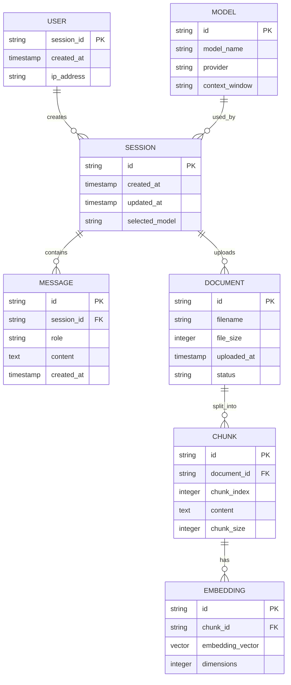

### Data Model Descriptions

| Entity | Description | Storage |
|--------|-------------|---------|
| USER | Browser session identifier | Session state |
| SESSION | Chat session metadata | Streamlit session_state |
| MESSAGE | Chat messages | Streamlit session_state |
| DOCUMENT | Uploaded PDF metadata | Memory/Temp |
| CHUNK | Text chunks from documents | ChromaDB |
| EMBEDDING | Vector representations | ChromaDB |
| MODEL | LLM model configuration | Application config |

---

## System Architecture

### High-Level Architecture

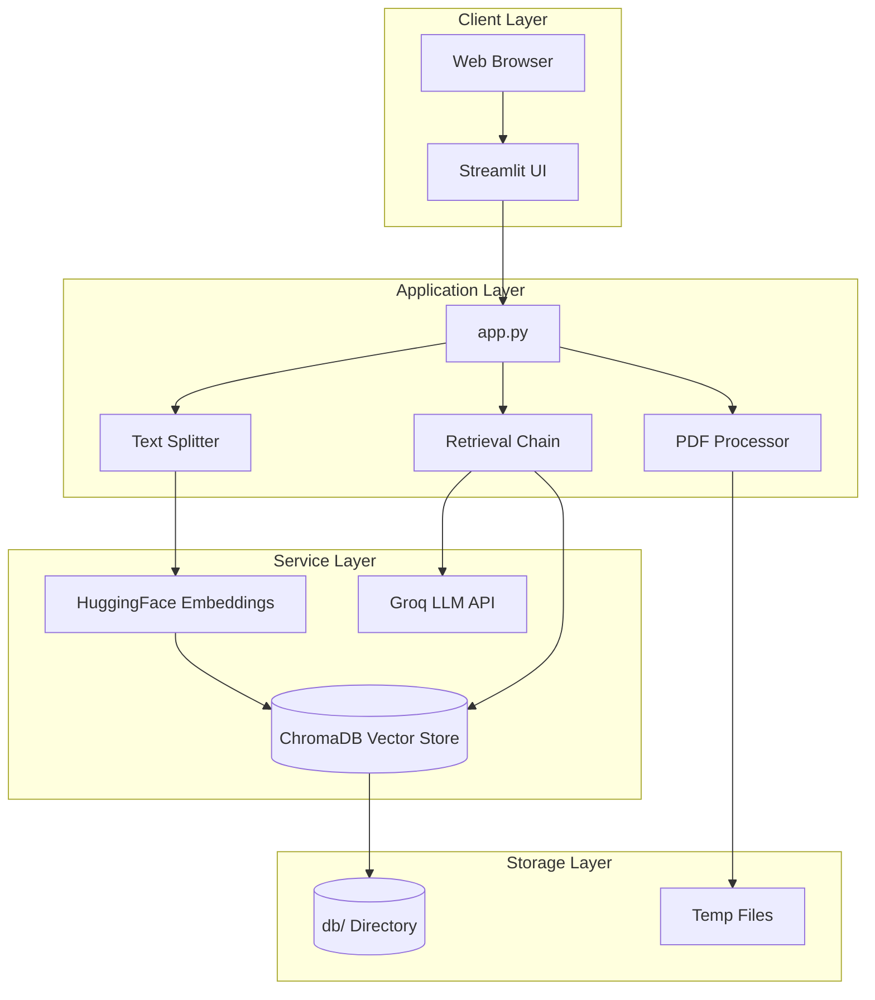

### Component Architecture

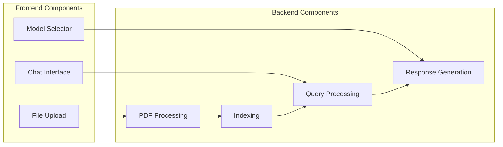

### Layered Architecture

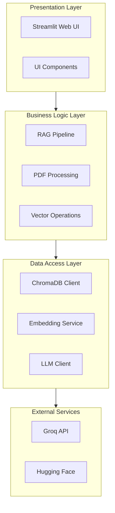

---

## Authentication Flow

### API Key Authentication Flow

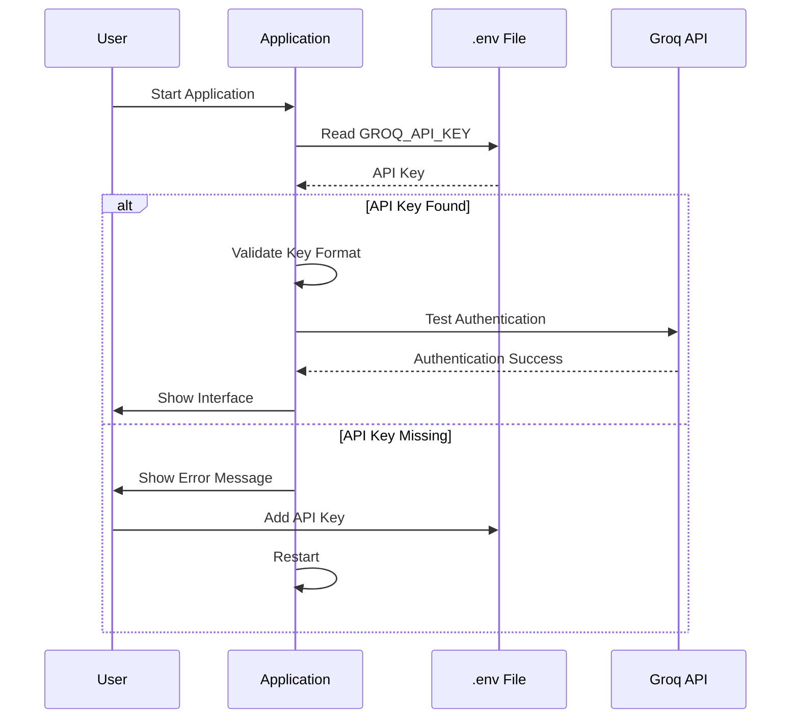

### Session Management Flow

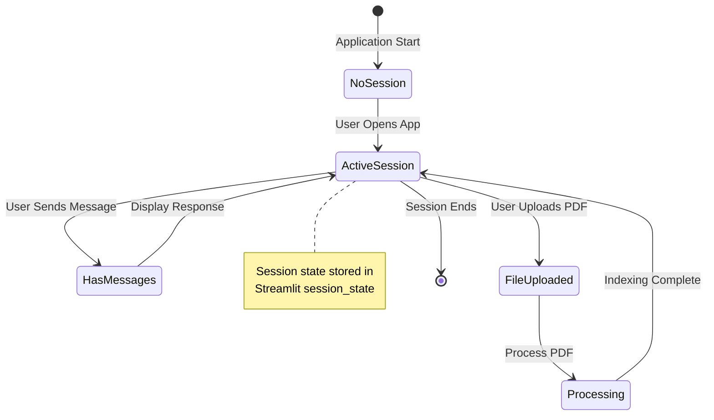

### Authentication States

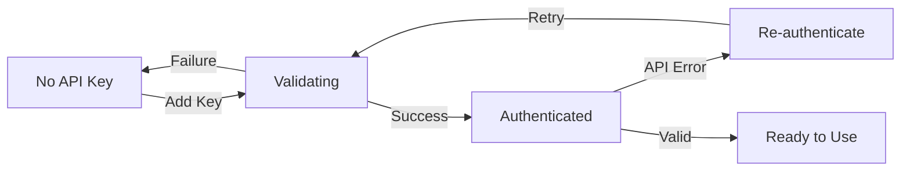

---

## CRUD Operations Flow

### Document Upload (Create)

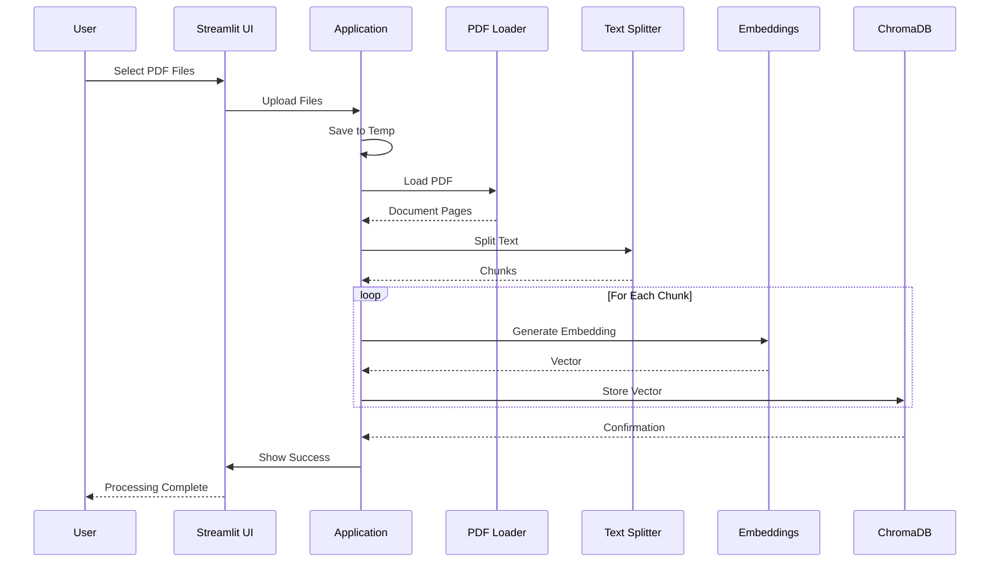

### Document Query (Read)

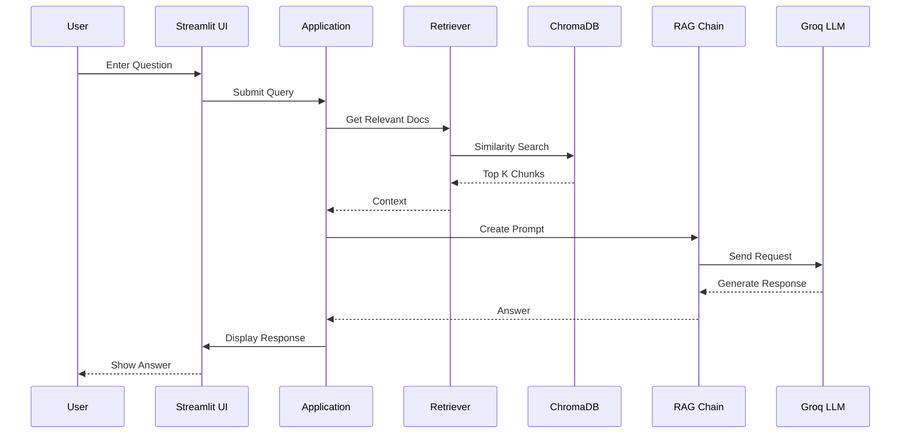

### Vector Store Update (Update)

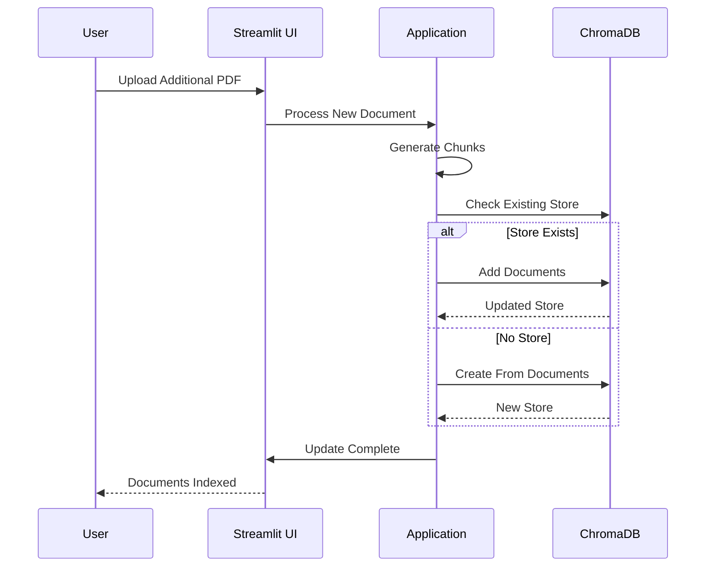

### Vector Store Reset (Delete)

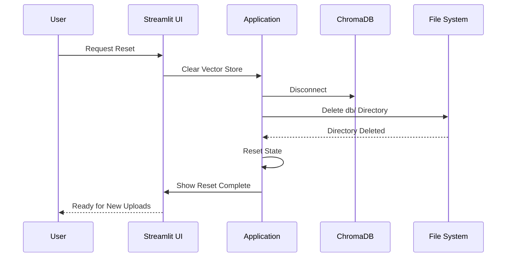

### Complete CRUD Flow

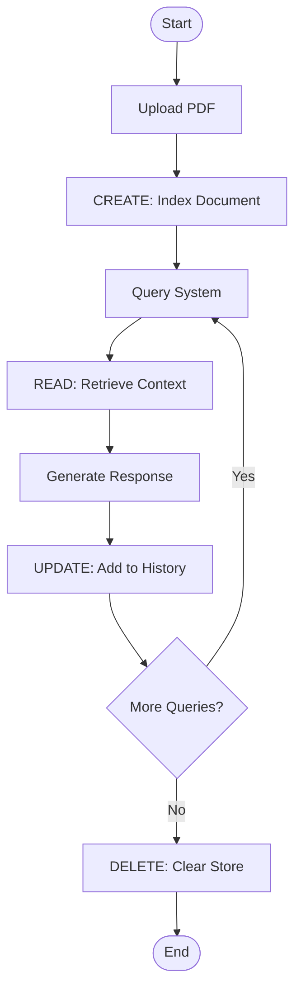

---

## Security Flow

### Request Security Flow

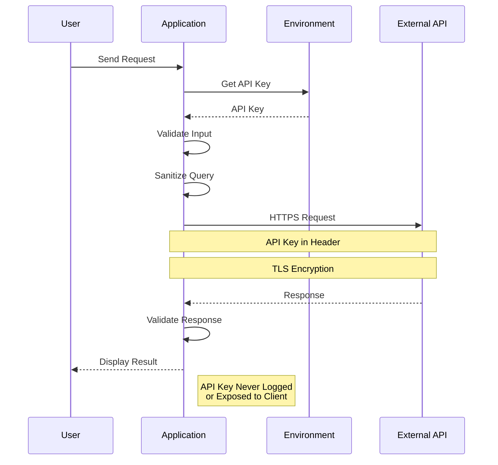

### Data Protection Flow

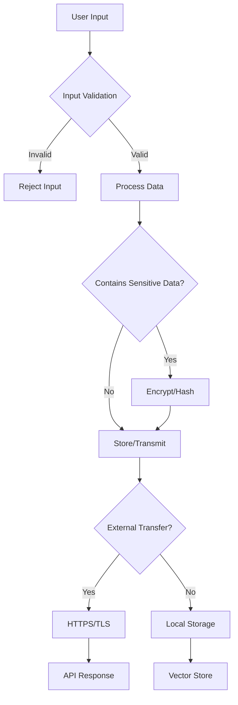

### Error Handling Security

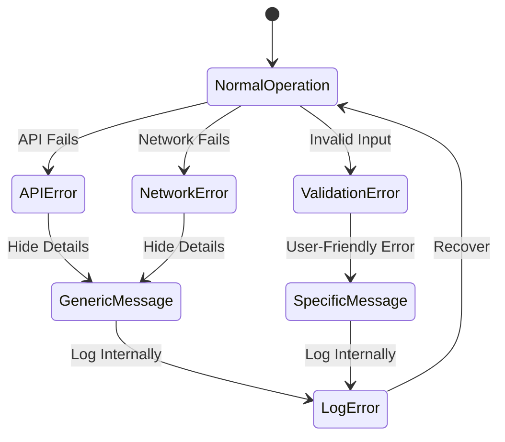

### Security Layers

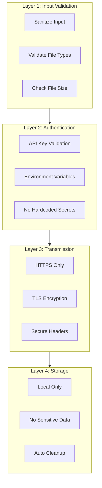

### Session Security Flow

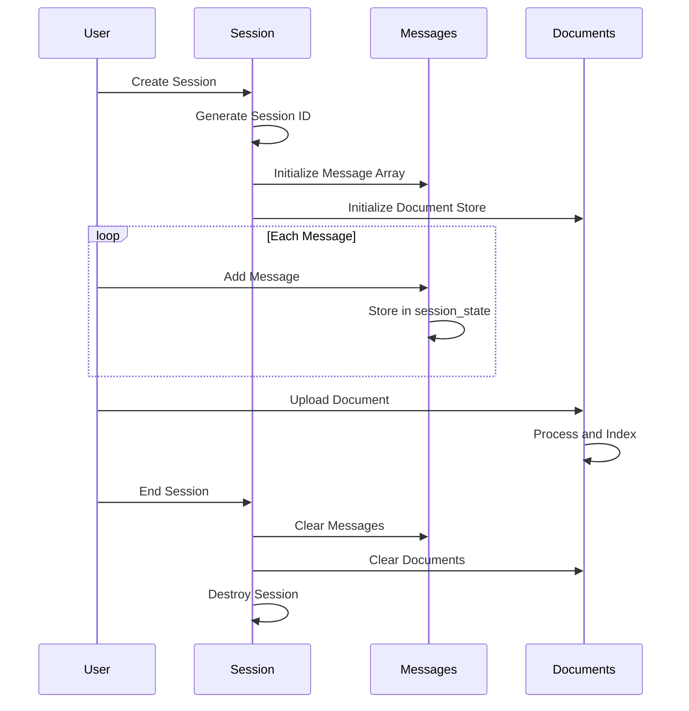

---

## RAG Pipeline Flow

### Complete RAG Process

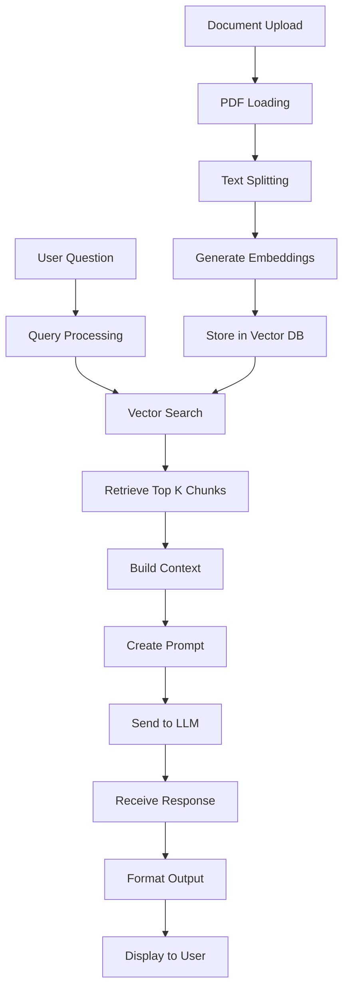

### Chunk Processing Flow

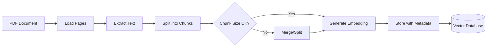

---

## Next Steps

- [Authentication & Security](authentication-security.md) - Detailed security documentation
- [Development Guide](development.md) - Development workflow
- [API Endpoints](api-endpoints.md) - API documentation
