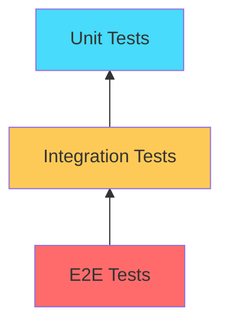

# Testing Guide

This guide covers testing strategies, procedures, and best practices for the RAG Chatbot application.

---

## Table of Contents

- [Testing Overview](#testing-overview)
- [Test Environment Setup](#test-environment-setup)
- [Manual Testing](#manual-testing)
- [Automated Testing](#automated-testing)
- [Integration Testing](#integration-testing)
- [Performance Testing](#performance-testing)
- [Test Coverage](#test-coverage)

---

## Testing Overview

### Testing Pyramid



### Test Types

| Type | Scope | Frequency | Tools |
|------|-------|-----------|-------|
| Unit | Individual functions | Every commit | pytest |
| Integration | Component interaction | Every commit | pytest |
| E2E | Full application flow | Before release | Manual/Selenium |
| Performance | Response times | Periodically | timeit, locust |

---

## Test Environment Setup

### Create Test Directory

```bash
# Create test structure
mkdir tests
mkdir tests/fixtures
touch tests/__init__.py
touch tests/test_app.py
touch tests/test_pdf_processor.py
touch tests/test_vector_store.py
touch tests/conftest.py
```

### Test Dependencies

Add to `requirements-dev.txt`:

```txt
pytest==8.0.0
pytest-cov==4.1.0
pytest-asyncio==0.23.0
pytest-mock==3.12.0
responses==0.25.0
```

### Install Test Dependencies

```bash
pip install -r requirements-dev.txt
```

### Pytest Configuration

Create `pytest.ini`:

```ini
[pytest]
testpaths = tests
python_files = test_*.py
python_functions = test_*
addopts = -v --cov=app --cov-report=html
```

---

## Manual Testing

### Manual Test Checklist

#### PDF Upload Tests

| Test Case | Steps | Expected Result |
|-----------|-------|-----------------|
| Upload single PDF | Select 1 PDF file | File processed successfully |
| Upload multiple PDFs | Select multiple PDFs | All files processed |
| Upload non-PDF | Select non-PDF file | Error message displayed |
| Upload large PDF | Select PDF > 50MB | File size error |
| Upload corrupted PDF | Select corrupted file | Graceful error handling |

#### Chat Functionality Tests

| Test Case | Steps | Expected Result |
|-----------|-------|-----------------|
| Ask question | Enter question in chat | Response generated |
| Ask without context | Ask before upload | "No context available" message |
| Ask unrelated question | Ask about topic not in PDF | Honest "don't know" response |
| Conversation history | Multiple questions | Context maintained |
| Model switching | Change model mid-chat | New model used |

#### Vector Store Tests

| Test Case | Steps | Expected Result |
|-----------|-------|-----------------|
| Persistence | Restart app after upload | Vectors still available |
| Multiple uploads | Upload more PDFs | Vectors accumulated |
| Reset store | Delete db/ folder | Clean state |

### Manual Testing Script

```bash
#!/bin/bash
# manual_test.sh

echo "=== RAG Chatbot Manual Testing ==="
echo ""
echo "1. Start the application:"
echo "   streamlit run app.py"
echo ""
echo "2. Test PDF Upload:"
echo "   - Upload laptop_manual.pdf"
echo "   - Wait for processing"
echo "   - Check success message"
echo ""
echo "3. Test Chat:"
echo "   - Ask: 'What is the warranty period?'"
echo "   - Verify response references document"
echo ""
echo "4. Test Model Selection:"
echo "   - Switch to different model"
echo "   - Ask same question"
echo "   - Compare responses"
echo ""
echo "5. Test Persistence:"
echo "   - Restart application"
echo "   - Ask question without re-upload"
echo "   - Verify context still available"
```

---

## Automated Testing

### Unit Tests

**tests/test_pdf_processor.py:**

```python
import pytest
from unittest.mock import Mock, patch
import tempfile
import os

def test_process_pdf_valid_file():
    """Test PDF processing with valid file."""
    from app import process_pdf
    
    # Create mock file
    mock_file = Mock()
    mock_file.read.return_value = b'%PDF-1.4 test content'
    
    with patch('app.PyPDFLoader') as mock_loader:
        mock_loader.return_value.load.return_value = [
            Mock(page_content='Test content')
        ]
        
        chunks = process_pdf(mock_file)
        
        assert len(chunks) > 0
        assert all(hasattr(chunk, 'page_content') for chunk in chunks)


def test_process_pdf_cleanup():
    """Test that temp files are cleaned up."""
    from app import process_pdf
    
    mock_file = Mock()
    mock_file.read.return_value = b'%PDF-1.4 test'
    
    temp_files = []
    
    with patch('tempfile.NamedTemporaryFile') as mock_temp:
        mock_temp.return_value.__enter__.return_value.name = '/tmp/test.pdf'
        temp_files.append('/tmp/test.pdf')
        
        with patch('app.PyPDFLoader'):
            with patch('os.remove') as mock_remove:
                process_pdf(mock_file)
                mock_remove.assert_called_once()
```

### Integration Tests

**tests/test_vector_store.py:**

```python
import pytest
import shutil
import os
from langchain_community.vectorstores import Chroma
from langchain_community.embeddings import HuggingFaceEmbeddings
from langchain.schema import Document


@pytest.fixture
def clean_db():
    """Fixture to clean db directory before and after tests."""
    db_path = 'test_db'
    
    # Cleanup before
    if os.path.exists(db_path):
        shutil.rmtree(db_path)
    
    yield db_path
    
    # Cleanup after
    if os.path.exists(db_path):
        shutil.rmtree(db_path)


def test_load_existing_vector_store_empty(clean_db):
    """Test loading non-existent vector store."""
    from app import load_existing_vector_store
    
    # Temporarily change persist_directory
    import app
    original_dir = app.persist_directory
    app.persist_directory = clean_db
    
    try:
        store = load_existing_vector_store()
        assert store is None
    finally:
        app.persist_directory = original_dir


def test_add_to_vector_store(clean_db):
    """Test adding documents to vector store."""
    from app import add_to_vector_store
    
    documents = [
        Document(page_content="Test content 1"),
        Document(page_content="Test content 2"),
    ]
    
    vector_store = add_to_vector_store(documents, vector_store=None)
    
    assert vector_store is not None
    assert vector_store._collection.count() == 2


def test_vector_store_persistence(clean_db):
    """Test that vector store persists across loads."""
    from langchain_community.vectorstores import Chroma
    from langchain_community.embeddings import HuggingFaceEmbeddings
    
    # Create store
    documents = [Document(page_content="Persistent content")]
    store1 = Chroma.from_documents(
        documents=documents,
        embedding=HuggingFaceEmbeddings(),
        persist_directory=clean_db,
    )
    
    # Load store
    store2 = Chroma(
        persist_directory=clean_db,
        embedding_function=HuggingFaceEmbeddings(),
    )
    
    assert store2._collection.count() == 1
```

### API Tests

**tests/test_api.py:**

```python
import pytest
from unittest.mock import Mock, patch
from langchain_groq import ChatGroq


@pytest.fixture
def mock_groq_response():
    """Mock Groq API response."""
    mock_response = Mock()
    mock_response.content = "This is a test response from the LLM."
    return mock_response


def test_ask_question(mock_groq_response):
    """Test question answering with mocked LLM."""
    from app import ask_question
    from langchain_community.vectorstores import Chroma
    from langchain.schema import Document
    
    # Create mock vector store
    mock_store = Mock(spec=Chroma)
    mock_store.as_retriever().invoke.return_value = [
        Document(page_content="Test context")
    ]
    
    with patch('app.ChatGroq') as MockChatGroq:
        mock_llm = Mock()
        mock_llm.invoke.return_value = mock_groq_response
        MockChatGroq.return_value = mock_llm
        
        response = ask_question(
            model="llama-3.3-70b-versatile",
            query="Test question?",
            vector_store=mock_store,
        )
        
        assert response is not None
        assert "test response" in response.lower()
```

### Conftest Fixtures

**tests/conftest.py:**

```python
import pytest
import os
import sys

# Add parent directory to path
sys.path.insert(0, os.path.dirname(os.path.dirname(os.path.abspath(__file__))))


@pytest.fixture
def sample_pdf_bytes():
    """Sample PDF bytes for testing."""
    # Minimal valid PDF header
    return b'%PDF-1.4\n1 0 obj\n<< /Type /Catalog >>\nendobj\ntrailer\n<< /Root 1 0 R >>\n%%EOF'


@pytest.fixture
def sample_documents():
    """Sample documents for testing."""
    from langchain.schema import Document
    return [
        Document(page_content="Document 1 content", metadata={"source": "doc1.pdf"}),
        Document(page_content="Document 2 content", metadata={"source": "doc2.pdf"}),
    ]


@pytest.fixture
def mock_embeddings():
    """Mock embeddings for testing."""
    from unittest.mock import Mock
    
    mock_emb = Mock()
    mock_emb.embed_query.return_value = [0.1] * 384
    mock_emb.embed_documents.return_value = [[0.1] * 384]
    return mock_emb
```

---

## Integration Testing

### End-to-End Flow Test

```python
def test_full_rag_pipeline():
    """Test complete RAG pipeline."""
    import tempfile
    import shutil
    from langchain.schema import Document
    
    # Setup
    test_db = tempfile.mkdtemp()
    
    try:
        # 1. Create documents
        documents = [
            Document(page_content="Python is a programming language."),
            Document(page_content="RAG stands for Retrieval-Augmented Generation."),
        ]
        
        # 2. Add to vector store
        from app import add_to_vector_store
        from langchain_community.embeddings import HuggingFaceEmbeddings
        from langchain_community.vectorstores import Chroma
        
        vector_store = Chroma.from_documents(
            documents=documents,
            embedding=HuggingFaceEmbeddings(),
            persist_directory=test_db,
        )
        
        # 3. Query
        results = vector_store.similarity_search("What is RAG?", k=1)
        
        # 4. Verify
        assert len(results) > 0
        assert "RAG" in results[0].page_content
        
    finally:
        shutil.rmtree(test_db)
```

### Component Integration Tests

```python
def test_pdf_to_vector_integration():
    """Test PDF upload to vector store integration."""
    from app import process_pdf, add_to_vector_store
    
    # Mock PDF file
    mock_file = Mock()
    mock_file.read.return_value = b'%PDF-1.4 content'
    
    with patch('app.PyPDFLoader') as mock_loader:
        mock_loader.return_value.load.return_value = [
            Mock(page_content="Test PDF content")
        ]
        
        # Process PDF
        chunks = process_pdf(mock_file)
        
        # Add to vector store
        vector_store = add_to_vector_store(chunks)
        
        # Verify
        assert vector_store is not None
```

---

## Performance Testing

### Response Time Tests

```python
import time
import pytest


def test_embedding_generation_performance():
    """Test embedding generation speed."""
    from langchain_community.embeddings import HuggingFaceEmbeddings
    
    embeddings = HuggingFaceEmbeddings()
    test_text = "This is a test sentence for performance testing."
    
    start = time.time()
    embedding = embeddings.embed_query(test_text)
    end = time.time()
    
    elapsed = end - start
    
    assert len(embedding) == 384
    assert elapsed < 5.0  # Should complete in under 5 seconds


def test_vector_search_performance():
    """Test vector search speed."""
    from langchain_community.vectorstores import Chroma
    from langchain_community.embeddings import HuggingFaceEmbeddings
    from langchain.schema import Document
    
    # Create store with documents
    documents = [
        Document(page_content=f"Document {i} content")
        for i in range(100)
    ]
    
    vector_store = Chroma.from_documents(
        documents=documents,
        embedding=HuggingFaceEmbeddings(),
    )
    
    # Time search
    start = time.time()
    results = vector_store.similarity_search("test query", k=5)
    elapsed = time.time() - start
    
    assert len(results) == 5
    assert elapsed < 1.0  # Should complete in under 1 second
```

### Load Testing

```python
# locustfile.py
from locust import HttpUser, task, between


class ChatbotUser(HttpUser):
    wait_time = between(1, 3)
    
    @task
    def ask_question(self):
        # Simulate asking a question
        self.client.post("/_stcore/stream", json={
            "question": "What is RAG?"
        })
```

---

## Test Coverage

### Running Coverage

```bash
# Run tests with coverage
pytest --cov=app --cov-report=html

# View HTML report
open htmlcov/index.html

# Run with verbose output
pytest -v --cov=app --cov-report=term-missing
```

### Coverage Goals

| Component | Target | Current |
|-----------|--------|---------|
| PDF Processing | 90% | TBD |
| Vector Store | 90% | TBD |
| Q&A Chain | 85% | TBD |
| UI Components | 70% | TBD |
| **Overall** | **85%** | **TBD** |

### Coverage Report Example

```
Name                Stmts   Miss  Cover   Missing
-------------------------------------------------
app.py                150     20    87%   45-48, 92-95, 120-125
-------------------------------------------------
TOTAL                 150     20    87%
```

---

## Continuous Integration

### GitHub Actions Workflow

Create `.github/workflows/tests.yml`:

```yaml
name: Tests

on:
  push:
    branches: [main]
  pull_request:
    branches: [main]

jobs:
  test:
    runs-on: ubuntu-latest
    
    steps:
    - uses: actions/checkout@v4
    
    - name: Set up Python
      uses: actions/setup-python@v5
      with:
        python-version: '3.10'
    
    - name: Install dependencies
      run: |
        pip install -r requirements.txt
        pip install -r requirements-dev.txt
    
    - name: Run tests
      run: |
        pytest --cov=app --cov-report=xml
    
    - name: Upload coverage
      uses: codecov/codecov-action@v3
      with:
        file: ./coverage.xml
```

---

## Troubleshooting Tests

### Common Test Issues

| Issue | Solution |
|-------|----------|
| Import errors | Check sys.path in conftest |
| API key errors | Mock external API calls |
| Slow tests | Use smaller test data |
| Flaky tests | Add proper fixtures |
| Coverage low | Add more unit tests |

### Test Debugging

```bash
# Run specific test
pytest tests/test_app.py::test_process_pdf -v

# Run with print output
pytest -s tests/test_app.py

# Run until first failure
pytest -x tests/

# Run last failed tests
pytest --lf
```

---

## Next Steps

- [Deployment](deployment.md) - Deployment procedures
- [Development Guide](development.md) - Development workflow
- [Contributing](contributing.md) - Contribution guidelines
